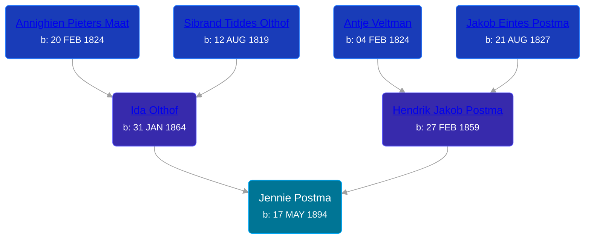

## 🟣 Jennie Postma
<small>Age: 81y, 10m, 27d</small>

Daughter of [Hendrik Jakob Postma](/people/3/31727152) and [Ida Olthof](/people/6/60020862)





### 📆 Events


Type | Date | Age at Event | Place
------ | ------ | ------ | ------
Birth | 17 MAY 1894 |  | Dutton, Kent, Michigan, USA
[Residence](#event-event-0) | 29 JUN 1900 | 6y, 1m, 12d | Gaines Township, Kent, Michigan, USA
[Residence](#event-event-1) | 1910 | 15y, 6m, 13d | Gaines Township, Kent, Michigan, USA
[Residence](#event-event-2) | 13 JAN 1920 | 25y, 7m, 26d | Maple Valley Township, Montcalm, Michigan, USA
[Residence](#event-event-3) | 08 APR 1930 | 35y, 10m, 21d | Paris Township, Kent, Michigan, USA
[Residence](#event-event-4) | 18 APR 1940 | 45y, 11m, 1d | Paris Township, Kent, Michigan, USA
[Death](#event-event-8) | 14 APR 1976 | 81y, 10m, 27d | East Grand Rapids, Kent, Michigan, USA
[Burial](#event-event-9) |  |  | Pine Hill Cemetery, Kentwood, Kent, Michigan, USA



- **Birth**
**Date**: 17 MAY 1894, Age:
**Place**: Dutton, Kent, Michigan, USA
- **[Residence](#event-event-0)**
**Date**: 29 JUN 1900, Age: 6y, 1m, 12d
**Place**: Gaines Township, Kent, Michigan, USA
- **[Residence](#event-event-1)**
**Date**: 1910, Age: 15y, 6m, 13d
**Place**: Gaines Township, Kent, Michigan, USA
- **[Residence](#event-event-2)**
**Date**: 13 JAN 1920, Age: 25y, 7m, 26d
**Place**: Maple Valley Township, Montcalm, Michigan, USA
- **[Residence](#event-event-3)**
**Date**: 08 APR 1930, Age: 35y, 10m, 21d
**Place**: Paris Township, Kent, Michigan, USA
- **[Residence](#event-event-4)**
**Date**: 18 APR 1940, Age: 45y, 11m, 1d
**Place**: Paris Township, Kent, Michigan, USA
- **[Death](#event-event-8)**
**Date**: 14 APR 1976, Age: 81y, 10m, 27d
**Place**: East Grand Rapids, Kent, Michigan, USA
- **[Burial](#event-event-9)**
**Date**:
**Place**: Pine Hill Cemetery, Kentwood, Kent, Michigan, USA


### 📰 Event Sources

####  Residence, 29 JUN 1900
* 1900 US Census
>   
  > Name: Jennie Postma  
  > Sex: Female  
  > Age: 6  
  > Birth Date: May 1894  
  > Birthplace: Michigan  
  > Marital Status: Single  
  > Race: White  
  > Relationship to Head of Household: Daughter  
  > Father's Birthplace: Holland  
  > Mother's Birthplace: Holland  
  > Event Type: Census  
  > Event Date: 1900  
  > Event Place: Gaines Township, Kent, Michigan, United States  
  > Line Number: 15  
  > Sheet Letter: A  
  > Sheet Number: 13

####  Residence, 1910
* 1910 US Census

####  Residence, 13 JAN 1920
* 1920 US Census

####  Residence, 08 APR 1930
* 1930 US Census

####  Residence, 18 APR 1940
* 1940 US Census

####  Death, 14 APR 1976
* Michigan Deaths, 1971-1996
>   
  > Name:  Jennie Weaver  
  > Birth Date: 17 May 1994  
  > Death Date: 14 Apr 1976  
  > Gender: Female  
  > Residence: Kentwood, Kent, Michigan  
  > Place of Death: East Grand Rapids, Kent, Michigan
* U.S., Social Security Death Index, 1935-2014
>   
  > Name: Jennie Weaver  
  > Last Residence: 49508 Grand Rapids, Kent, Michigan, USA  
  > BORN: 17 May 1894  
  > Died: Apr 1976  
  > State (Year) SSN issued: Michigan (1973)
* The Grand Rapids Press  - 15 Apr 1976
>   
  > WEAVER -- Mrs. Jennie (Postma) Weaver, aged 81, of Kentwood passed away unexpectedly Wednesday, April 14, 1976. Surviving are her children, James H. of Dutton, Harold R. of Dutton, Theodore E. of Grand Rapids, Robert L. of Texas, Mrs. Roger (Lucille) Laven of Dutton, Mrs. Richard(Ruth) VanSledright of Kentwood, Mrs. William (Lorna) Snodgrass of West Virginia; 20 grandchildren, 10 great-grandchildren; two brothers, Peter Postma of Wyoming, Charles Postma of Grand Rapids; a sister Mrs. William (Clara) Slager of Wyoming; several nieces and nephews. Funeralservices will be held Saturday at 11 AM at the funeral chapel with her pastor the Rev. Ollie V. Goad of Wealthy Street Baptist Church officiating. Interment Pine Hill Cemetery

####  Burial
* Pine Hill Cemetery, Personal Visit
>   
  > Weaver, Jennie (Wife)  
  > b: 1894; d: 1976
