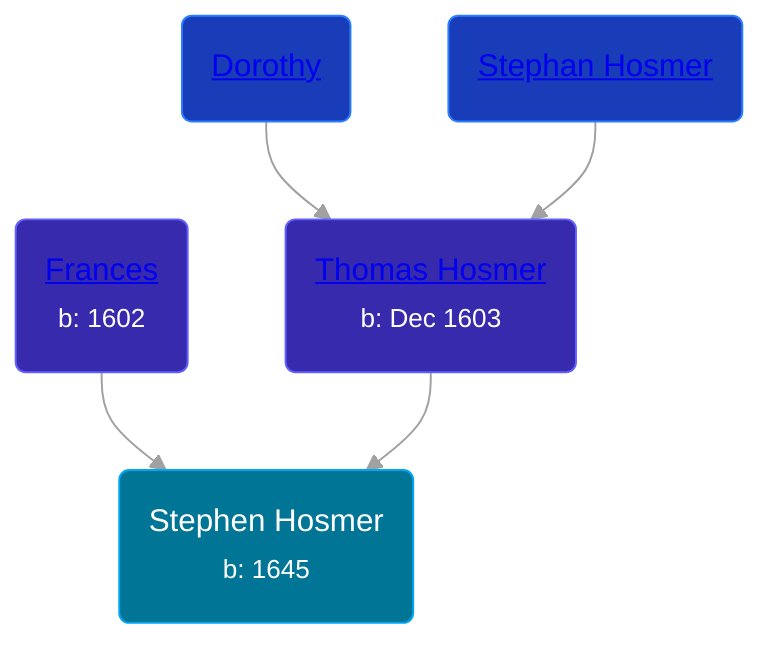

## 🔵 Stephen Hosmer
<small>Age: 48y, 11m, 4d</small>

Son of [Thomas Hosmer](/people/7/70805658) and [Frances ](/people/1/15178620)





### 📆 Events


Type | Date | Age at Event | Place
------ | ------ | ------ | ------
[Birth](#event-event-2) | 1645 |  |
[Death](#event-event-3) | 04 NOV 1693 | 48y, 11m, 4d |



- **[Birth](#event-event-2)**
**Date**: 1645, Age:
**Place**:
- **[Death](#event-event-3)**
**Date**: 04 NOV 1693, Age: 48y, 11m, 4d
**Place**:


### 📰 Event Sources

####  Birth, 1645
* Genealogy of the Hosmer Family  - 4

####  Death, 04 NOV 1693
* Genealogy of the Hosmer Family  - 4