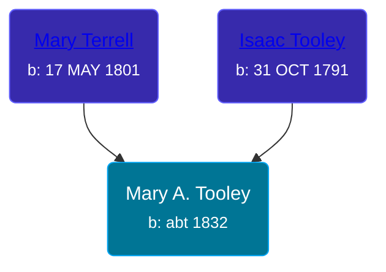

## 🟣 Mary A. Tooley

Daughter of [Isaac Tooley](/people/6/65071054) and [Mary Terrell](/people/3/36199064)





### 📆 Events


Type | Date | Age at Event | Place
------ | ------ | ------ | ------
Birth | abt 1832 |  |
[Residence](#event-event-0) | 11 SEP 1850 | 18y, 9m, 11d | Shelby, Orleans, New York, USA



- **Birth**
**Date**: abt 1832, Age:
**Place**:
- **[Residence](#event-event-0)**
**Date**: 11 SEP 1850, Age: 18y, 9m, 11d
**Place**: Shelby, Orleans, New York, USA


### 📰 Event Sources

####  Residence, 11 SEP 1850
* 1850 US Census
