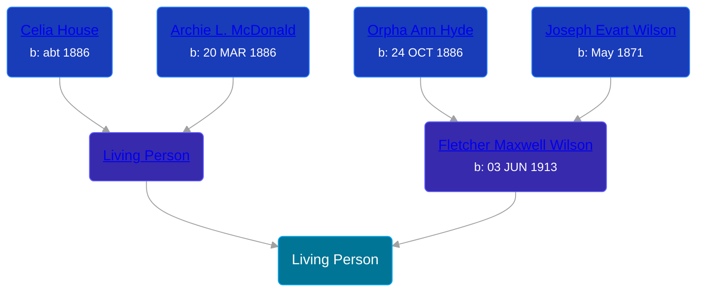

## 🔵 Living Person

Son of [Fletcher Maxwell Wilson](/people/3/32597724) and [Living Person](/people/1/1324224)





## 👩‍❤️‍👨 Relationships

### 🟣 [Living Person](/people/8/88617856)

#### Children With Living Person
* 🟣 [Living Person](/people/4/49195211)
* 🟣 [Living Person](/people/5/54804204)
* 🔵 [Living Person](/people/7/72785160)
* 🟣 [Living Person](/people/8/8322480)
* 🟣 [Living Person](/people/4/44584454)
### 🟣 [Living Person](/people/2/25459314)

#### Children With Living Person
* 🟣 [Living Person](/people/4/4830818)
* 🟣 [Living Person](/people/3/32879973)
* 🔵 [Living Person](/people/3/34424064)