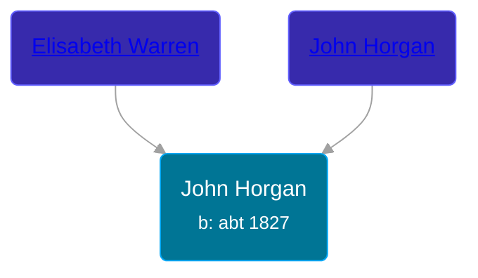

## 🔵 John Horgan

Son of [John Horgan](/people/4/42410084) and [Elisabeth Warren](/people/6/68775768)





### 📆 Events


Type | Date | Age at Event | Place
------ | ------ | ------ | ------
Birth | abt 1827 |  | Ireland
[Residence](#event-event-0) | 1861 | 34y | Ellice, Perth, Ontario, Canada
[Residence](#event-event-1) | 1871 | 44y | Perth, Ontario, Canada
[Burial](#event-event-5) |  |  | Saint Andrew Cemetery, Saginaw, Saginaw, Michigan, USA



- **Birth**
**Date**: abt 1827, Age:
**Place**: Ireland
- **[Residence](#event-event-0)**
**Date**: 1861, Age: 34y
**Place**: Ellice, Perth, Ontario, Canada
- **[Residence](#event-event-1)**
**Date**: 1871, Age: 44y
**Place**: Perth, Ontario, Canada
- **[Burial](#event-event-5)**
**Date**:
**Place**: Saint Andrew Cemetery, Saginaw, Saginaw, Michigan, USA


## 👩‍❤️‍👨 Relationships

### 🟣 [Honora Crowley](/people/7/72193795), b. abt 1834

#### Events


Type | Date | Age at Event | Place
------ | ------ | ------ | ------
[Marriage](#event-family-0-event-0) | 08 JAN 1855 | 28y, 1m, 8d | Stratford, Ontario, Canada



- **[Marriage](#event-family-0-event-0)**
**Date**: 08 JAN 1855, Age: 28y, 1m, 8d
**Place**: Stratford, Ontario, Canada


#### Children With Honora Crowley
* 🔵 [John Horgan](/people/1/12278671), b. abt 1856
* 🟣 [Mary Ann Horgan](/people/9/90749846), b. 11 JUL 1857
* 🟣 [Eleanor Horgan](/people/3/34125056), b. abt 1859
* 🔵 [Daniel Horgan](/people/1/15488992), b. 30 MAY 1863
* 🔵 [Cornalious Horgan](/people/8/8594961), b. abt 1864
* 🟣 [Margaret Horgan](/people/7/77180611), b. abt 1866
* 🟣 [Bridgett Horgan](/people/3/30208492), b. about 1868
### 📰 Event Sources

####  Residence, 1861
* 1861 Canada Census
>   
  > Name: John Horgan  
  > Sex: Male  
  > Age: 39y  
  > Birth Date: 1822  
  > Birthplace: Ireland  
  > Residence Date: 1861  
  > Residence Place: Ellice, Perth, Ontario, Canada  
  > Marital Status: Married  
  > Married During Year: 1855  
  > Religion: Roman Catholic  
  > Event Type: Census  
  > Event Date: 1861  
  > Event Place: Ellice, Perth, Ontario, Canada  
  > Line Number: 21  
  > Sheet Number: 27  
  > Microfilm Number: 2435937  
  > Indexing Batch: N03134-7  
  >   
  > Household members:  
  > John Horgan, 34  
  > Honora, 27  
  > John, 5  
  > Mary Ann, 3  
  > Eleanor, 2  
  >

####  Residence, 1871
* 1871 Canada Census
>   
  > Name: John Horgan  
  > Sex: Male  
  > Age: 44 years  
  > Birth Date: 1827  
  > Birth Year (Estimated): 1827  
  > Birthplace: Ireland  
  > Marital Status: Married  
  > Nationality: Irish  
  > Religion: Catholic  
  > Event Type: Census  
  > Event Date: 1871  
  > Event Place: Perth, Ontario, Canada  
  > Sub-District: Ellice  
  > Household Identifier: 1  
  > House Number: 1  
  > Line Number: 3  
  > Page Number:   
  >   
  > Household members:  
  > - John Horgan, M, 44  
  > - Hanorah Horgan, F, 37  
  > - John Horgan, M, 15  
  > - Mary Ann Horgan, F, 13  
  > - Ellan Horgan, F, 11  
  > - Daniel Horgan, M, 9  
  > - Cornalious Horgan, M, 7  
  > - Margret Horgan, F, 5  
  > - Bridgett Horgan, F, 3  
  >

####  Burial
* findagrave.com

####  Marriage, 08 JAN 1855
* Ontario, Canada, Roman Catholic Baptisms, Marriages, and Burials, 1760-1923
>   
  > Name: Hanara Crowley  
  > Gender: Female  
  > Event Type: Marriage  
  > Marriage Date: 8 Jan 1855  
  > Marriage Place: Stratford, Ontario, Canada  
  > Father: Michael Crowley  
  > Mother: Mary Morphy  
  > Spouse: John Hargan  
  > Gender: Male  
  > Father: John Hargan  
  > Mother: Elisabeth Warren