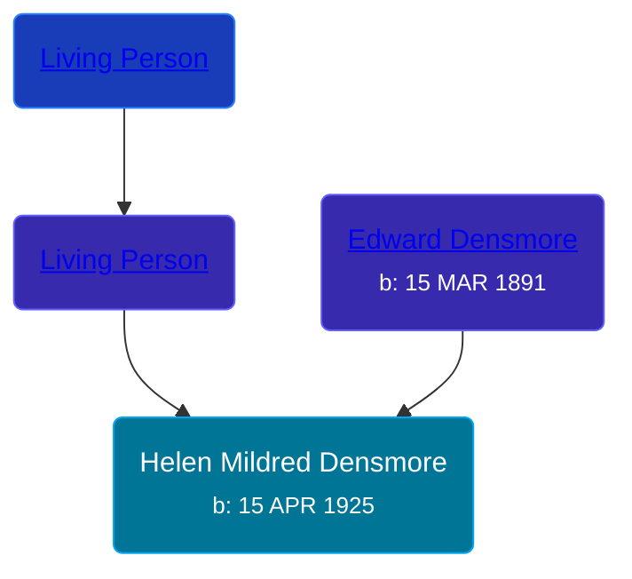

## 🟣 Helen Mildred Densmore
<small>Age: 65y, 9m, 22d</small>

Daughter of [Edward Densmore](/people/7/75117844) and [Living Person](/people/7/7869963)





### 📆 Events


Type | Date | Age at Event | Place
------ | ------ | ------ | ------
Birth | 15 APR 1925 |  | Michigan, USA
[Residence](#event-event-0) | 12 APR 1930 | 4y, 11m, 27d | Rives, Jackson, Michigan, USA
[Residence](#event-event-1) | 13 APR 1950 | 24y, 11m, 28d | Norvell Township, Jackson, Michigan, USA
[Death](#event-event-6) | 07 FEB 1991 | 65y, 9m, 22d | Jackson, Jackson, Michigan, USA
[Burial](#event-event-7) |  |  | Hillcrest Memorial Park, Jackson, Jackson, Michigan, USA



- **Birth**
**Date**: 15 APR 1925, Age:
**Place**: Michigan, USA
- **[Residence](#event-event-0)**
**Date**: 12 APR 1930, Age: 4y, 11m, 27d
**Place**: Rives, Jackson, Michigan, USA
- **[Residence](#event-event-1)**
**Date**: 13 APR 1950, Age: 24y, 11m, 28d
**Place**: Norvell Township, Jackson, Michigan, USA
- **[Death](#event-event-6)**
**Date**: 07 FEB 1991, Age: 65y, 9m, 22d
**Place**: Jackson, Jackson, Michigan, USA
- **[Burial](#event-event-7)**
**Date**:
**Place**: Hillcrest Memorial Park, Jackson, Jackson, Michigan, USA


## 👩‍❤️‍👨 Relationships

### 🔵 [Harry William Barton](/people/8/83492690), b. 15 FEB 1919

#### Children With Harry William Barton
* 🟣 [Living Person](/people/9/92410091)
* 🔵 [Living Person](/people/4/42360279)
* 🔵 [Robert Elvin Barton](/people/4/48782300), b. 06 AUG 1945
* 🔵 [Richard Dale Barton](/people/8/81394146), b. 11 AUG 1949
* 🔵 [Living Person](/people/7/7769050)
### 📰 Event Sources

####  Residence, 12 APR 1930
* 1930 US Census

####  Residence, 13 APR 1950
* 1950 US Census
>   
  > Name: Helen M Barton  
  > Sex: Female  
  > Age: 24 years  
  > Birth Year (Estimated): 1926  
  > Birthplace: Michigan  
  > Marital Status: Married  
  > Race: W  
  > Relationship to Head of Household: Wife  
  > Event Date: 12 April 1950  
  > Event Place: Norvell, Norvell Township, Jackson, Michigan, United States  
  > Event Place (Original): Norvell, Jackson, Michigan  
  > Enumeration District: 38-122  
  > Line Number: 2  
  > Page Number: 13  
  >   
  > Harry W Barton, Head, 31 years, Michigan  
  > Helen M Barton, Wife, 24 years, Michigan  
  > Harry W Barton, Jr, Son, 5 years, Michigan  
  > Robert E Barton, Son, 4 years, Michigan  
  > Richard D Barton, Son, 0 years, Michigan

####  Death, 07 FEB 1991
* U.S., Social Security Death Index, 1935-2014
>   
  > Name: HELEN M BARTON  
  > Birth: 15 Apr 1925  
  > Death: 07 Feb 1991  
  > Last Residence: (not specified)  
  > Last Benefit: (none specified)  
  > SSN: ###-##-####  
  > Issued: Michigan
* Michigan Deaths, 1971-1996
>   
  > Name:  Helen M Barton  
  > Birth Date: 15 Apr 1925  
  > Death Date: 7 Feb 1991  
  > Gender: Female  
  > Residence: Springport, Jackson, Michigan  
  > Place of Death: Jackson, Jackson, Michigan

####  Burial
* findagrave.com
