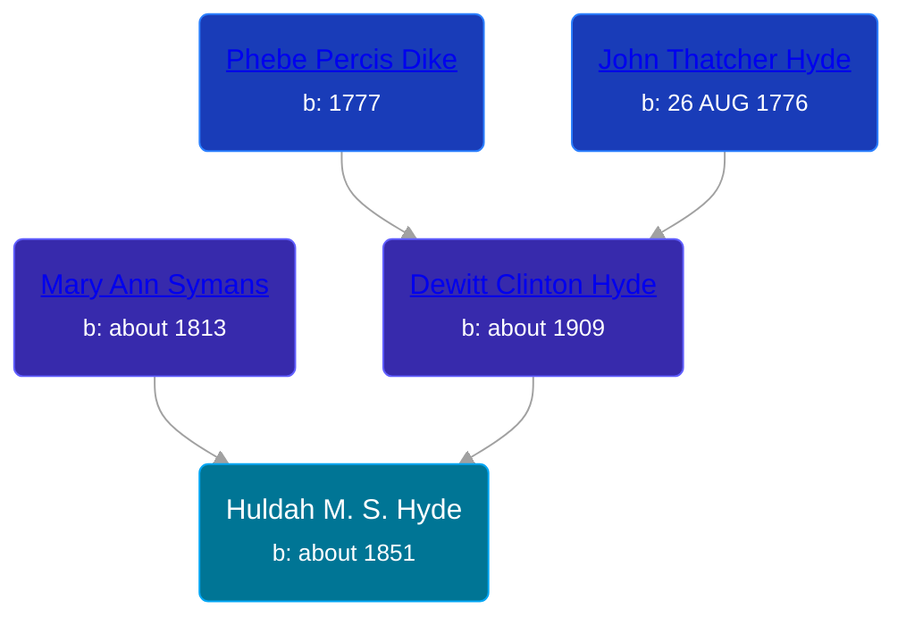

## 🟣 Huldah M. S. Hyde

Daughter of [Dewitt Clinton Hyde](/people/4/47530864) and [Mary Ann Symans](/people/4/4704808)





### 📆 Events


Type | Date | Age at Event | Place
------ | ------ | ------ | ------
Birth | about 1851 |  |
[Residence](#event-event-0) | June 1855 | 4y, 6m | Amity, Allegany, New York, USA
[Residence](#event-event-1) | 11 JUL 1860 | 9y, 7m, 11d | Watertown, Clinton, Michigan, USA



- **Birth**
**Date**: about 1851, Age:
**Place**:
- **[Residence](#event-event-0)**
**Date**: June 1855, Age: 4y, 6m
**Place**: Amity, Allegany, New York, USA
- **[Residence](#event-event-1)**
**Date**: 11 JUL 1860, Age: 9y, 7m, 11d
**Place**: Watertown, Clinton, Michigan, USA


### 📰 Event Sources

####  Residence, June 1855
* 1855 New York State Census

####  Residence, 11 JUL 1860
* 1860 US Census
