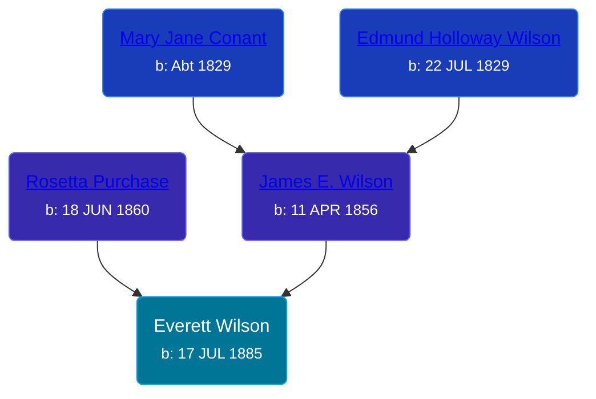

## 🔵 Everett Wilson
<small>Age: 50y, 21d</small>

Son of [James E. Wilson](/people/5/54950695) and [Rosetta Purchase](/people/2/27770192)





### 📆 Events


Type | Date | Age at Event | Place
------ | ------ | ------ | ------
Birth | 17 JUL 1885 |  | Michigan, USA
[Residence](#event-event-0) | 1920 | 34y, 4m, 13d | Grand Rapids, Kent, Michigan, United States
[Death](#event-event-4) | 08 AUG 1935 | 50y, 21d | Grand Rapids, Kent, Michigan, United States



- **Birth**
**Date**: 17 JUL 1885, Age:
**Place**: Michigan, USA
- **[Residence](#event-event-0)**
**Date**: 1920, Age: 34y, 4m, 13d
**Place**: Grand Rapids, Kent, Michigan, United States
- **[Death](#event-event-4)**
**Date**: 08 AUG 1935, Age: 50y, 21d
**Place**: Grand Rapids, Kent, Michigan, United States


## 👩‍❤️‍👨 Relationships

### 🟣 [Living Person](/people/4/43910042)

### 📰 Event Sources

####  Residence, 1920
* 1920 US Census

####  Death, 08 AUG 1935
* Michigan, Death Records, 1867-1950
>   
  > Name:Everett Wilson  
  > Gender:Male  
  > Marital Status:Married  
  > Birth Date:Jul, 1885  
  > Birth Place:Michigan  
  > Death Date:8 Aug 1935  
  > Death Place:Grand Rapids, Kent, Michigan, USA  
  > Death Age:50  
  > File Number:024120  
  > Father:James Wilson  
  > Mother:Rosetta Purchase  
  > Wife: Hattie
