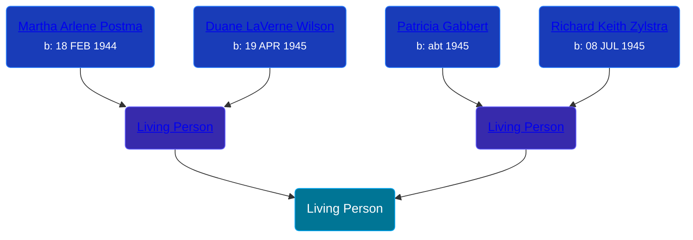

## 🔵 Living Person

Son of [Living Person](/people/8/89027494) and [Living Person](/people/4/47560746)





## 👩‍❤️‍👨 Relationships

### 🟣 [Living Person](/people/2/28950416)

#### Children With Living Person
* 🔵 [Living Person](/people/6/69350741)