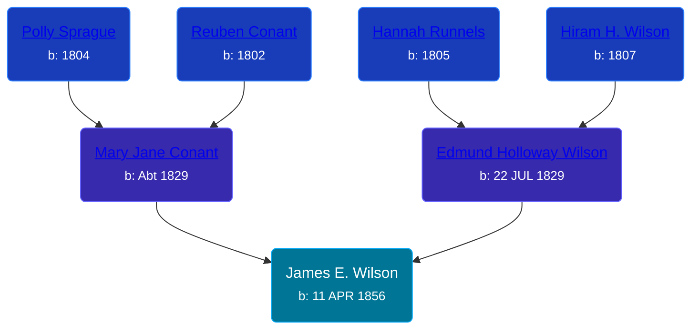

## 🔵 James E. Wilson
<small>Age: 75y, 8m, 10d</small>

Son of [Edmund Holloway Wilson](/people/6/67777324) and [Mary Jane Conant](/people/2/27722232)





### 📆 Events


Type | Date | Age at Event | Place
------ | ------ | ------ | ------
Birth | 11 APR 1856 |  | Butler, Wayne, New York, USA
[Residence](#event-event-0) | 1860 | 3y, 7m, 19d | Butler, Wayne, New York, USA
[Residence](#event-event-1) | 1870 | 13y, 7m, 19d | Allendale, Ottawa, Michigan, USA
[Residence](#event-event-2) | 1880 | 23y, 7m, 19d | Robinson Township, Ottawa, Michigan, USA
[Residence](#event-event-3) | 1910 | 53y, 7m, 19d | Home Township, Montcalm, Michigan, USA
[Residence](#event-event-4) | 1920 | 63y, 7m, 19d | Grand Rapids, Kent, Michigan, United States
[Residence](#event-event-5) | 1930 | 73y, 7m, 19d | Alpine Township, Kent, Michigan, USA
[Death](#event-event-9) | 21 DEC 1931 | 75y, 8m, 10d | Michigan, USA



- **Birth**
**Date**: 11 APR 1856, Age:
**Place**: Butler, Wayne, New York, USA
- **[Residence](#event-event-0)**
**Date**: 1860, Age: 3y, 7m, 19d
**Place**: Butler, Wayne, New York, USA
- **[Residence](#event-event-1)**
**Date**: 1870, Age: 13y, 7m, 19d
**Place**: Allendale, Ottawa, Michigan, USA
- **[Residence](#event-event-2)**
**Date**: 1880, Age: 23y, 7m, 19d
**Place**: Robinson Township, Ottawa, Michigan, USA
- **[Residence](#event-event-3)**
**Date**: 1910, Age: 53y, 7m, 19d
**Place**: Home Township, Montcalm, Michigan, USA
- **[Residence](#event-event-4)**
**Date**: 1920, Age: 63y, 7m, 19d
**Place**: Grand Rapids, Kent, Michigan, United States
- **[Residence](#event-event-5)**
**Date**: 1930, Age: 73y, 7m, 19d
**Place**: Alpine Township, Kent, Michigan, USA
- **[Death](#event-event-9)**
**Date**: 21 DEC 1931, Age: 75y, 8m, 10d
**Place**: Michigan, USA


## 👩‍❤️‍👨 Relationships

### 🟣 [Rosetta Purchase](/people/2/27770192), b. 18 JUN 1860

#### Events


Type | Date | Age at Event | Place
------ | ------ | ------ | ------
[Marriage](#event-family-0-event-0) | 29 AUG 1878 | 22y, 4m, 18d | Olive Township, Ottawa, Michigan, USA



- **[Marriage](#event-family-0-event-0)**
**Date**: 29 AUG 1878, Age: 22y, 4m, 18d
**Place**: Olive Township, Ottawa, Michigan, USA


#### Children With Rosetta Purchase
* 🟣 [Anna L. Wilson](/people/7/73378674), b. 30 JUL 1879
* 🟣 [Mary Estelle Wilson](/people/4/46787428), b. 23 APR 1881
* 🟣 [Lenora Wilson](/people/4/43167007), b. 31 JUL 1883
* 🔵 [Everett Wilson](/people/5/5482456), b. 17 JUL 1885
* 🟣 [Hazel Wilson](/people/2/23514264), b. about 1895
* 🔵 [Raymond Eugene Wilson](/people/8/81165742), b. about 1895
* 🟣 [Hannah P. Wilson](/people/2/21937522), b. 27 OCT 1899
### 📰 Event Sources

####  Residence, 1860
* 1860 US Census

####  Residence, 1870
* 1870 US Census

####  Marriage, 29 AUG 1878
* Michigan, Marriage Records, 1867-1952
>   
  > Name:Rosetta Purchase  
  > Gender:Female  
  > Race:White  
  > Birth Year:abt 1860  
  > Birth Place:Olive, Michigan  
  > Marriage Date:29 Aug 1878  
  > Marriage Place:Olive Township, Ottawa, Michigan, USA  
  > Age:18  
  > Residence Place:Olive, Michigan  
  > Spouse:James E Wilson  
  > Gender:Male  
  > Race:White  
  > Birth Year:abt 1876  
  > Birth Place:Butler, New York  
  > Age:2??  
  > Residence Place:Robinson, Michigan  
  > Record Number:146  
  > Film:16  
  > Film Description:1878 Hillsdale - 1878 Van Buren

####  Residence, 1880
* 1880 US Census

####  Residence, 1910
* 1910 US Census

####  Residence, 1920
* 1920 US Census

####  Residence, 1930
* 1930 US Census

####  Death, 21 DEC 1931
* The Grand Rapids Press  - 21 Dec 1931, Page 12
>   
  > WILSON- James Wilson aged 75 passed away very suddenly Monday morning at his home 312 Graham St. S.W. Surviving are his widow Rosetta: four daughters; Mrs. Leora Pickard of Constantine, Mrs. Mary Whiting and Mrs. Hazel Whiting, both of Alpine and Mrs. Hanna Bowman of Grand Rapids, two sons Evert and Eugene Wilson of Grand Rapids, twenty grandchildren four great grandchildren and one brother , Joseph Wilson of Grand Rapids. The Body was removed to Jolderama & Sons Funeral Home 833 Grandville-av S.W. where funeral services will be held Wednesday afternoon at 2:30.