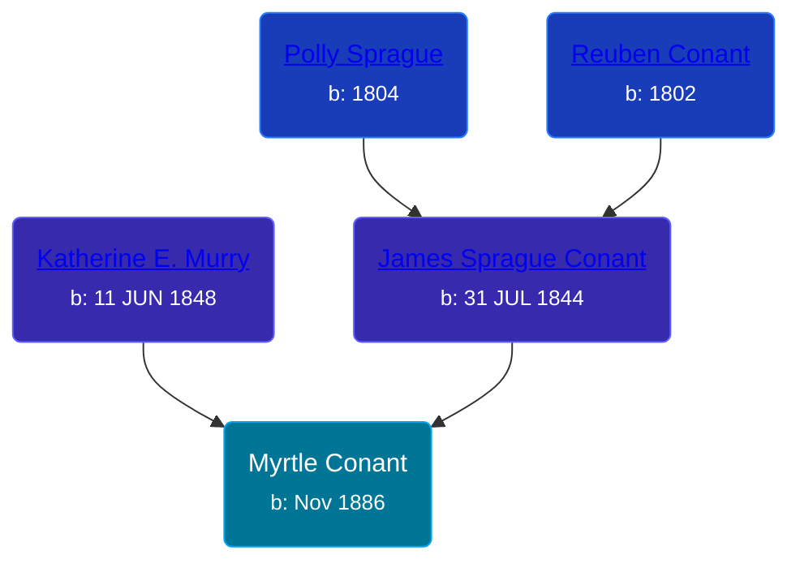

## 🟣 Myrtle Conant

Daughter of [James Sprague Conant](/people/6/62404416) and [Katherine E. Murry](/people/2/25746290)





### 📆 Events


Type | Date | Age at Event | Place
------ | ------ | ------ | ------
Birth | Nov 1886 |  | Michigan, USA
[Residence](#event-event-0) | 1900 | 13y, 1m | Robinson Township, Ottawa, Michigan, USA



- **Birth**
**Date**: Nov 1886, Age:
**Place**: Michigan, USA
- **[Residence](#event-event-0)**
**Date**: 1900, Age: 13y, 1m
**Place**: Robinson Township, Ottawa, Michigan, USA


### 📰 Event Sources

####  Residence, 1900
* 1900 US Census
