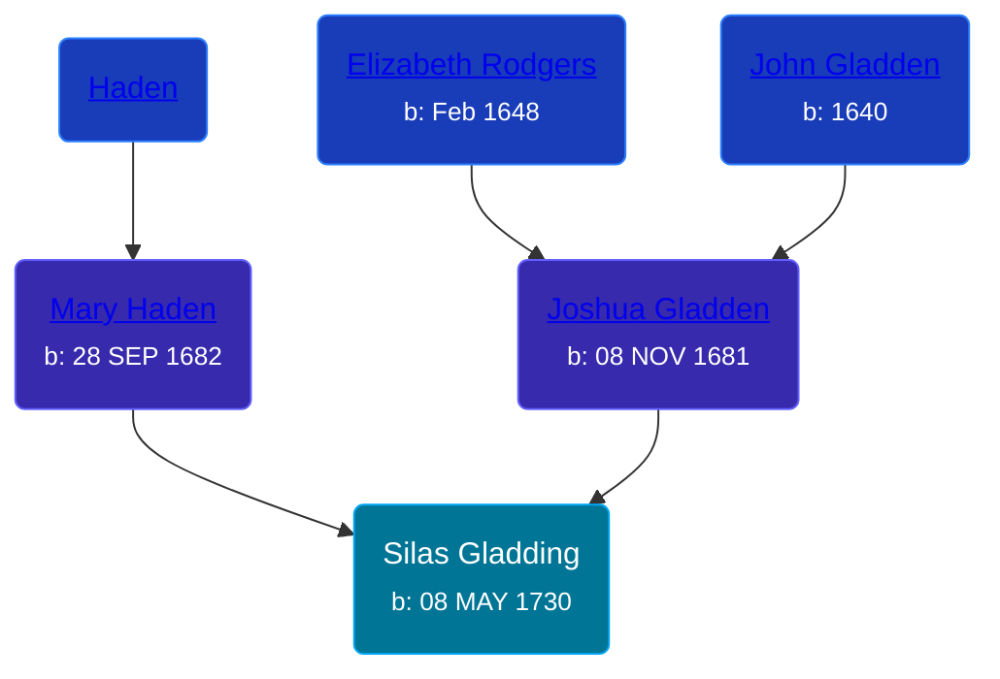

## 🔵 Silas Gladding
<small>Age: 83y, 7m, 25d</small>

Son of [Joshua Gladden](/people/9/97378440) and [Mary Haden](/people/1/19224987)





### 📆 Events


Type | Date | Age at Event | Place
------ | ------ | ------ | ------
Birth | 08 MAY 1730 |  | Saybrook, Middlesex, Connecticut, USA
Death | 03 JAN 1814 | 83y, 7m, 25d | Saybrook, Middlesex, Connecticut, USA



- **Birth**
**Date**: 08 MAY 1730, Age:
**Place**: Saybrook, Middlesex, Connecticut, USA
- **Death**
**Date**: 03 JAN 1814, Age: 83y, 7m, 25d
**Place**: Saybrook, Middlesex, Connecticut, USA


## 👩‍❤️‍👨 Relationships

### 🟣 [Hannah Jones](/people/3/3592220), b. 15 NOV 1741

#### Events


Type | Date | Age at Event | Place
------ | ------ | ------ | ------
Marriage | 14 MAY 1762 | 32y, 6d | Saybrook, Middlesex, Connecticut, USA



- **Marriage**
**Date**: 14 MAY 1762, Age: 32y, 6d
**Place**: Saybrook, Middlesex, Connecticut, USA


#### Children With Hannah Jones
* 🟣 [Hannah Gladding](/people/8/88055086), b. 16 NOV 1762
* 🔵 [James Gladding](/people/5/58213774), b. 01 JAN 1775
### 📰 Event Sources

####  Marriage, 14 MAY 1762
