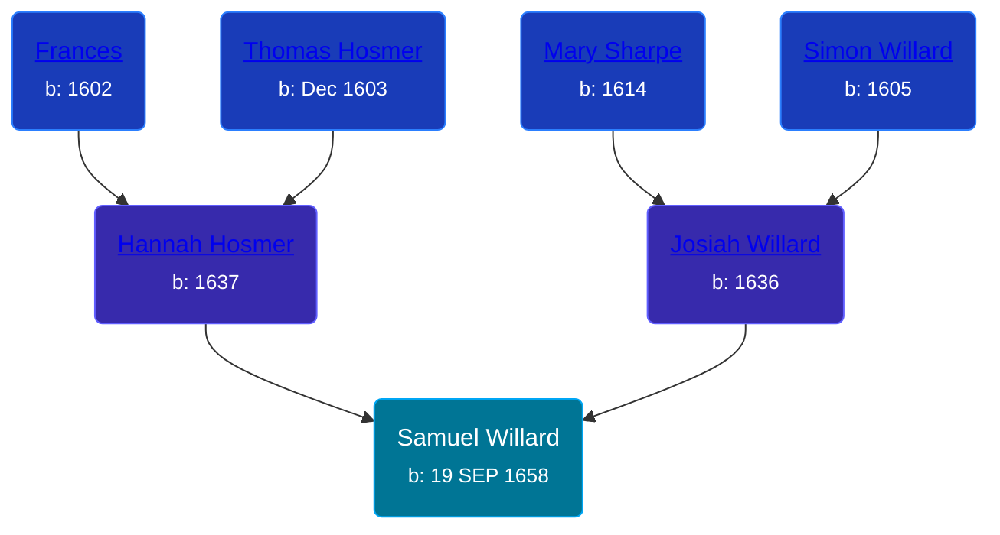

## 🔵 Samuel Willard
<small>Age: 54y, 2m, 11d</small>

Son of [Josiah Willard](/people/5/55775674) and [Hannah Hosmer](/people/7/74814464)





### 📆 Events


Type | Date | Age at Event | Place
------ | ------ | ------ | ------
[Birth](#event-event-2) | 19 SEP 1658 |  | Hartford, Connecticut, USA
[Death](#event-event-3) | 1713 | 54y, 2m, 11d | Saybrook, Middlesex, Connecticut, USA



- **[Birth](#event-event-2)**
**Date**: 19 SEP 1658, Age:
**Place**: Hartford, Connecticut, USA
- **[Death](#event-event-3)**
**Date**: 1713, Age: 54y, 2m, 11d
**Place**: Saybrook, Middlesex, Connecticut, USA


## 👩‍❤️‍👨 Relationships

### 🟣 [Living Person](/people/9/93595493)

#### Children With Living Person
* 🔵 [Samuel Willard](/people/1/12362566), b. 08 MAY 1693
* 🔵 [Joseph Willard](/people/2/22076724), b. 23 JUL 1696
### 📰 Event Sources

####  Birth, 19 SEP 1658
* American Ancestry: Giving Name and Descent  - 95
* Hall Ancestry: A series of Sketches of the Lineal Ancestors  - 168
* Willard Memoir: Sketch of the Life of Maj. Simon Willard  - 8

####  Death, 1713
* American Ancestry: Giving Name and Descent  - 95