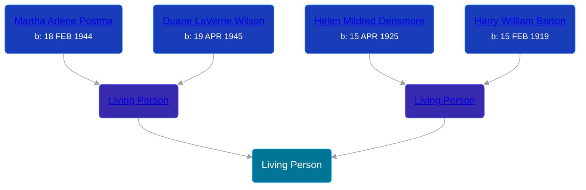

## 🔵 Living Person

Son of [Living Person](/people/7/7769050) and [Living Person](/people/9/92555368)



```mermaid
graph
classDef grands fill:#193cb8,stroke:#2b7fff,stroke-width:1px,color:#fff;
classDef parents fill:#372aac,stroke:#615fff,stroke-width:1px,color:#fff;
classDef primary fill:#007595,stroke:#00a6f4,stroke-width:1px,color:#fff;
55580943(Living Person):::primary
92555368(<a class="text-white" href="/people/9/92555368">Living Person</a>):::parents-->55580943
39368292(<a class="text-white" href="/people/3/39368292">Martha Arlene Postma</a><br /><small>b: 18 FEB 1944</small>):::grands-->92555368
61086158(<a class="text-white" href="/people/6/61086158">Duane LaVerne Wilson</a><br /><small>b: 19 APR 1945</small>):::grands-->92555368
7769050(<a class="text-white" href="/people/7/7769050">Living Person</a>):::parents-->55580943
54702290(<a class="text-white" href="/people/5/54702290">Helen Mildred Densmore</a><br /><small>b: 15 APR 1925</small>):::grands-->7769050
83492690(<a class="text-white" href="/people/8/83492690">Harry William Barton</a><br /><small>b: 15 FEB 1919</small>):::grands-->7769050
linkStyle default stroke:#a1a1a1
```

