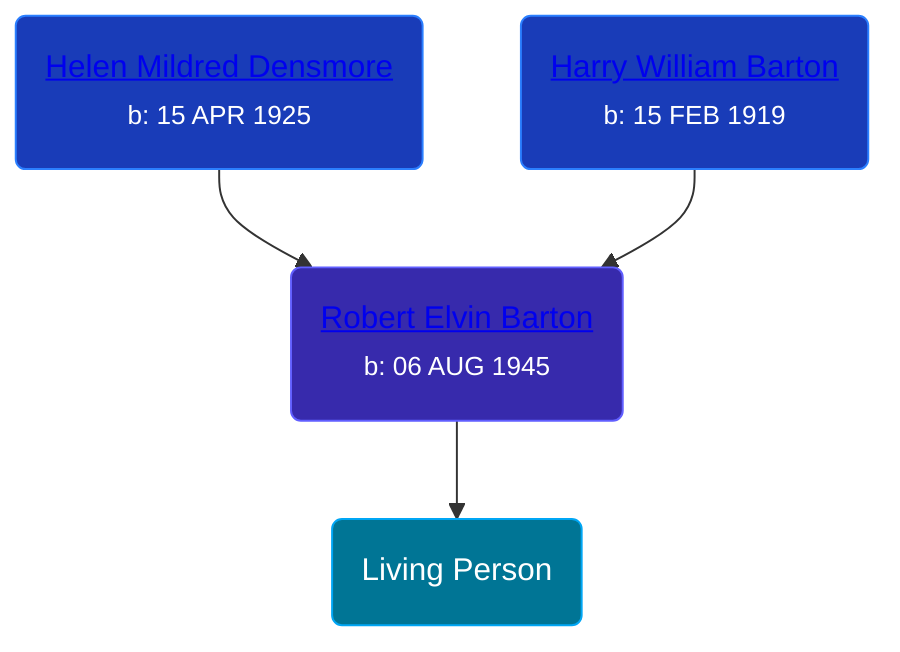

## 🔵 Living Person

Son of [Robert Elvin Barton](/people/4/48782300)





## 👩‍❤️‍👨 Relationships

### 🟣 [Living Person](/people/5/51377024)

#### Children With Living Person
* 🔵 [Living Person](/people/4/47183798)
* 🔵 [Living Person](/people/3/31304063)
* 🔵 [Living Person](/people/8/82508044)