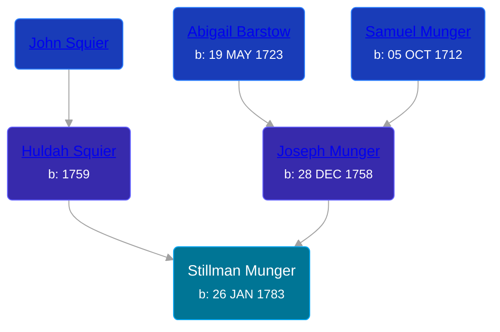

## 🔵 Stillman Munger

Son of [Joseph Munger](/people/4/48832802) and [Huldah Squier](/people/4/40449307)





### 📆 Events


Type | Date | Age at Event | Place
------ | ------ | ------ | ------
[Birth](#event-event-2) | 26 JAN 1783 |  | South Brimfield, Massachusetts, USA
[Death](#event-event-3) |  |  | Chicopee Falls, Hapden, Massachusetts, USA



- **[Birth](#event-event-2)**
**Date**: 26 JAN 1783, Age:
**Place**: South Brimfield, Massachusetts, USA
- **[Death](#event-event-3)**
**Date**:
**Place**: Chicopee Falls, Hapden, Massachusetts, USA


### 📰 Event Sources

####  Birth, 26 JAN 1783
* Massachusetts, Town and Vital Records, 1620-1988  - 274
* The History of Ludlow, Massachusetts  - 431

####  Death
* The History of Ludlow, Massachusetts  - 431
* Massachusetts, Town and Vital Records, 1620-1988  - 274