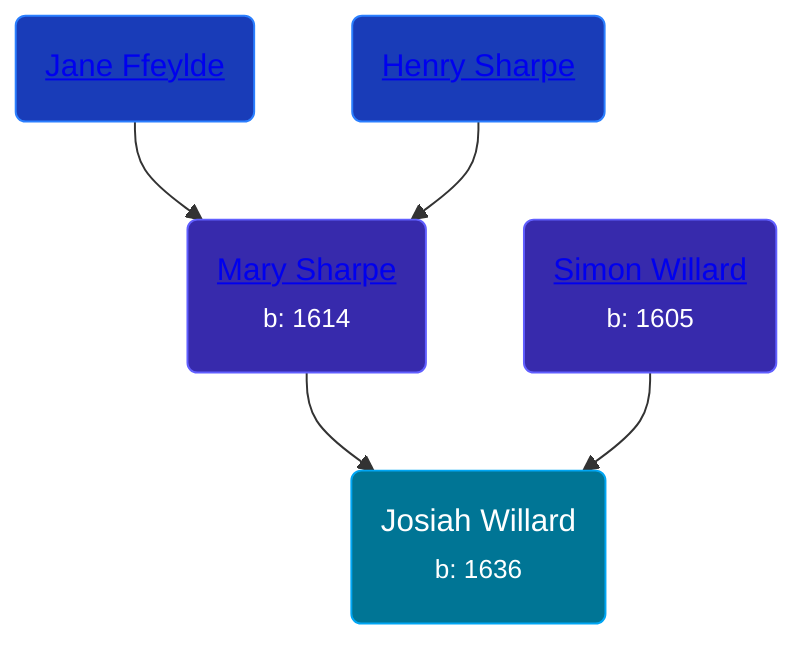

## 🔵 Josiah Willard
<small>Age: 38y</small>

Son of [Simon Willard](/people/8/86485776) and [Mary Sharpe](/people/1/10735316)





### 📆 Events


Type | Date | Age at Event | Place
------ | ------ | ------ | ------
[Birth](#event-event-2) | 1636 |  |
[Death](#event-event-3) | 1674 | 38y | Wethersfield, Connecticut, USA



- **[Birth](#event-event-2)**
**Date**: 1636, Age:
**Place**:
- **[Death](#event-event-3)**
**Date**: 1674, Age: 38y
**Place**: Wethersfield, Connecticut, USA


## 👩‍❤️‍👨 Relationships

### 🟣 [Hannah Hosmer](/people/7/74814464), b. 1637

#### Events


Type | Date | Age at Event | Place
------ | ------ | ------ | ------
[Marriage](#event-family-0-event-0) | 20 MAR 1657 | 21y, 3m, 20d |



- **[Marriage](#event-family-0-event-0)**
**Date**: 20 MAR 1657, Age: 21y, 3m, 20d
**Place**:


#### Children With Hannah Hosmer
* 🟣 [Living Person](/people/2/27216875)
* 🔵 [Living Person](/people/2/25833079)
* 🔵 [Living Person](/people/6/61327134)
* 🔵 [Living Person](/people/9/99257872)
* 🔵 [Living Person](/people/4/49277572)
* 🔵 [Samuel Willard](/people/5/55389376), b. 19 SEP 1658
* 🔵 [Josiah Willard](/people/3/32045392), b. 13 MAR 1660
* 🟣 [Hannah Willard](/people/8/87282882), b. 1673
### 📰 Event Sources

####  Birth, 1636
* American Ancestry: Giving Name and Descent

####  Marriage, 20 MAR 1657
* American Ancestry: Giving Name and Descent  - 95
* Genealogy of the Hosmer Family  - 4
* Willard Memoir: Sketch of the Life of Maj. Simon Willard  - 8
* Hall Ancestry: A series of Sketches of the Lineal Ancestors  - 168
####  Death, 1674
* Willard Memoir: Sketch of the Life of Maj. Simon Willard  - 8
* American Ancestry: Giving Name and Descent
