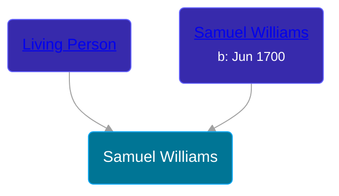

## 🔵 Samuel Williams

Son of [Samuel Williams](/people/9/90108080) and [Living Person](/people/2/27215076)



```mermaid
graph
classDef grands fill:#193cb8,stroke:#2b7fff,stroke-width:1px,color:#fff;
classDef parents fill:#372aac,stroke:#615fff,stroke-width:1px,color:#fff;
classDef primary fill:#007595,stroke:#00a6f4,stroke-width:1px,color:#fff;
55971024(Samuel Williams):::primary
27215076(<a class="text-white" href="/people/2/27215076">Living Person</a>):::parents-->55971024
90108080(<a class="text-white" href="/people/9/90108080">Samuel Williams</a><br /><small>b: Jun 1700</small>):::parents-->55971024
linkStyle default stroke:#a1a1a1
```


## 👩‍❤️‍👨 Relationships

### 🟣 [Lois Scott](/people/3/31542750)

#### Events


Type | Date | Age at Event | Place
------ | ------ | ------ | ------
[Marriage](#event-family-0-event-0) | 28 MAY 1752 | undefined |



- **[Marriage](#event-family-0-event-0)**
**Date**: 28 MAY 1752, Age: undefined
**Place**:


#### Children With Lois Scott
* 🔵 [Samuel Williams](/people/6/659680), b. 09 SEP 1753
### 🟣 [Huldah ](/people/6/62871690)

#### Events


Type | Date | Age at Event | Place
------ | ------ | ------ | ------
[Marriage](#event-family-1-event-0) | 27 AUG 1754 | undefined |



- **[Marriage](#event-family-1-event-0)**
**Date**: 27 AUG 1754, Age: undefined
**Place**:


#### Children With Huldah
* 🟣 [Lois Williams](/people/1/11658684), b. 24 MAY 1755
* 🔵 [Zebah Williams](/people/7/77989824), b. 09 MAY 1757
* 🔵 [Huldah Williams](/people/2/28699716), b. 26 JAN 1760
* 🟣 [Elizabeth Williams](/people/2/27796808), b. 21 MAR 1762
* 🟣 [Lucy Williams](/people/3/30981683), b. 26 APR 1764
* 🟣 [Rhoda Williams](/people/2/220352), b. 17 APR 1767
* 🔵 [Sibbel Williams](/people/6/60503451), b. 02 OCT 1769
* 🔵 [Samuel Warner Williams](/people/2/2994960), b. 11 MAY 1772
* 🟣 [Hannah Williams](/people/8/80814952), b. 15 NOV 1775
### 📰 Event Sources

####  Marriage, 28 MAY 1752
* The Town and City of Waterbury, Connecticut - 154

####  Marriage, 27 AUG 1754
* The Town and City of Waterbury, Connecticut - 154
