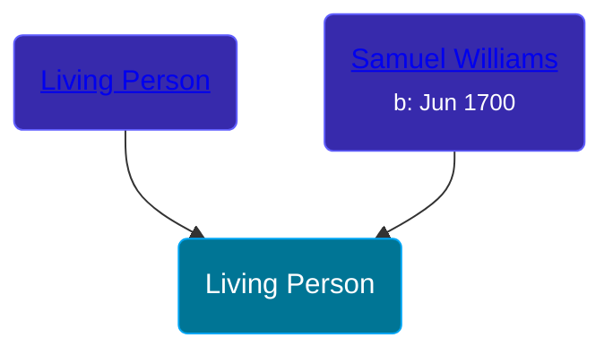

## 🔵 Living Person

Son of [Samuel Williams](/people/9/90108080) and [Living Person](/people/2/27215076)





## 👩‍❤️‍👨 Relationships

### 🟣 [Lois Scott](/people/3/31542750)

#### Children With Lois Scott
* 🔵 [Samuel Williams](/people/6/659680), b. 09 SEP 1753
### 🟣 [Living Person](/people/6/62871690)

#### Children With Living Person
* 🟣 [Lois Williams](/people/1/11658684), b. 24 MAY 1755
* 🔵 [Zebah Williams](/people/7/77989824), b. 09 MAY 1757
* 🔵 [Huldah Williams](/people/2/28699716), b. 26 JAN 1760
* 🟣 [Elizabeth Williams](/people/2/27796808), b. 21 MAR 1762
* 🟣 [Lucy Williams](/people/3/30981683), b. 26 APR 1764
* 🟣 [Rhoda Williams](/people/2/220352), b. 17 APR 1767
* 🔵 [Sibbel Williams](/people/6/60503451), b. 02 OCT 1769
* 🔵 [Samuel Warner Williams](/people/2/2994960), b. 11 MAY 1772
* 🟣 [Hannah Williams](/people/8/80814952), b. 15 NOV 1775