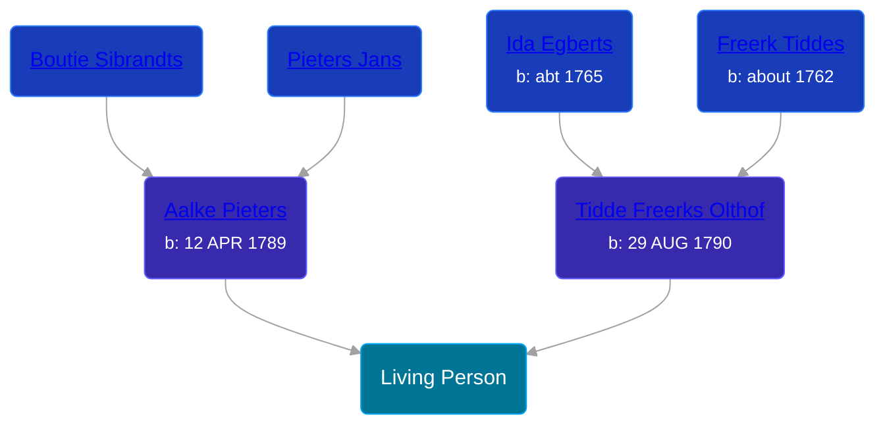

## 🔵 Living Person

Son of [Tidde Freerks Olthof](/people/7/7481187) and [Aalke Pieters](/people/7/70796984)



```mermaid
graph
classDef grands fill:#193cb8,stroke:#2b7fff,stroke-width:1px,color:#fff;
classDef parents fill:#372aac,stroke:#615fff,stroke-width:1px,color:#fff;
classDef primary fill:#007595,stroke:#00a6f4,stroke-width:1px,color:#fff;
56284680(Living Person):::primary
70796984(<a class="text-white" href="/people/7/70796984">Aalke Pieters</a><br /><small>b: 12 APR 1789</small>):::parents-->56284680
52450158(<a class="text-white" href="/people/5/52450158">Boutie Sibrandts</a>):::grands-->70796984
70270996(<a class="text-white" href="/people/7/70270996">Pieters Jans</a>):::grands-->70796984
7481187(<a class="text-white" href="/people/7/7481187">Tidde Freerks Olthof</a><br /><small>b: 29 AUG 1790</small>):::parents-->56284680
68075578(<a class="text-white" href="/people/6/68075578">Ida Egberts</a><br /><small>b: abt 1765</small>):::grands-->7481187
21111317(<a class="text-white" href="/people/2/21111317">Freerk Tiddes</a><br /><small>b: about 1762</small>):::grands-->7481187
linkStyle default stroke:#a1a1a1
```

