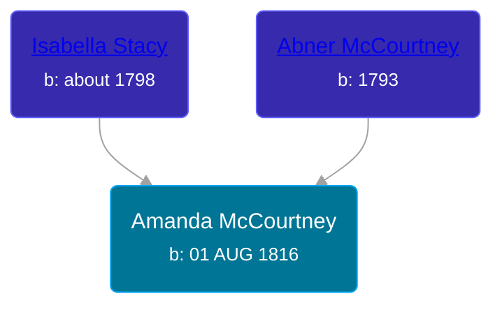

## 🟣 Amanda McCourtney

Daughter of [Abner McCourtney](/people/7/72592264) and [Isabella Stacy](/people/9/91476553)





### 📆 Events


Type | Date | Age at Event | Place
------ | ------ | ------ | ------
[Birth](#event-event-3) | 01 AUG 1816 |  | Clay, Kentucky, USA
[Residence](#event-event-0) | 24 SEP 1850 | 34y, 1m, 23d | Jackson, Kosciusko, Indiana, USA
[Residence](#event-event-1) | 18 OCT 1860 | 44y, 2m, 17d | Jackson, Kosciusko, Indiana, USA
[Burial](#event-event-6) |  |  | Spring Creek Cemetery, Sidney, Kosciusko, Indiana, USA



- **[Birth](#event-event-3)**
**Date**: 01 AUG 1816, Age:
**Place**: Clay, Kentucky, USA
- **[Residence](#event-event-0)**
**Date**: 24 SEP 1850, Age: 34y, 1m, 23d
**Place**: Jackson, Kosciusko, Indiana, USA
- **[Residence](#event-event-1)**
**Date**: 18 OCT 1860, Age: 44y, 2m, 17d
**Place**: Jackson, Kosciusko, Indiana, USA
- **[Burial](#event-event-6)**
**Date**:
**Place**: Spring Creek Cemetery, Sidney, Kosciusko, Indiana, USA


## 👩‍❤️‍👨 Relationships

### 🔵 [Alexander Hapner](/people/6/68586072), b. 05 JAN 1809

#### Events


Type | Date | Age at Event | Place
------ | ------ | ------ | ------
[Marriage](#event-family-0-event-0) | 18 JUL 1834 | 17y, 11m, 17d | Montgomery, Ohio, USA



- **[Marriage](#event-family-0-event-0)**
**Date**: 18 JUL 1834, Age: 17y, 11m, 17d
**Place**: Montgomery, Ohio, USA


#### Children With Alexander Hapner
* 🔵 [Nelson H. Hapner](/people/3/30042860), b. abt 1836
* 🟣 [Isabella Jane Hapner](/people/7/7784900), b. abt 1839
* 🔵 [Jasper A. Hapner](/people/8/86358624), b. Jan 1840
* 🔵 [Harrison B. Hapner](/people/4/48986000), b. Jan 1842
* 🟣 [Sarah Elma Hapner](/people/2/20173654), b. 20 AUG 1847
* 🟣 [Vianna Amanda Hapner](/people/3/33886681), b. abt 1853
### 📰 Event Sources

####  Birth, 01 AUG 1816
* Ron Wilson's Research

####  Residence, 24 SEP 1850
* 1850 US Census
>   
  > Name: Amanda Hapney  
  > Gender: Female  
  > Race: White  
  > Age: 33  
  > Birth Year: abt 1817  
  > Birthplace: Kentucky  
  > Home in 1850: Jackson, Kosciusko, Indiana, USA  
  > Line Number: 42  
  > Dwelling Number: 68  
  > Family Number: 68  
  > Inferred Spouse: Alexander Hapney

####  Residence, 18 OCT 1860
* 1860 US Census
>   
  > Name: Amanda Hapner  
  > Age: 44  
  > Birth Year: 1816  
  > Gender: Female  
  > Race: White  
  > Birth Place: Kentucky  
  > Home in 1860: Jackson, Kosciusko, Indiana  
  > Post Office: Clear Springs  
  > Dwelling Number: 1438  
  > Family Number: 1438  
  > Inferred Spouse: Alexander Hapner

####  Burial
* findagrave.com
####  Marriage, 18 JUL 1834
* Ohio, County Marriages, 1774-1993
>   
  > Name: Amanda Mccortney  
  > Gender: Female  
  > Marriage Date: 18 Jul 1834  
  > Marriage Place: Montgomery, Ohio, USA  
  > Spouse: Alexander Hapner  
  > Film Number: 001030834
