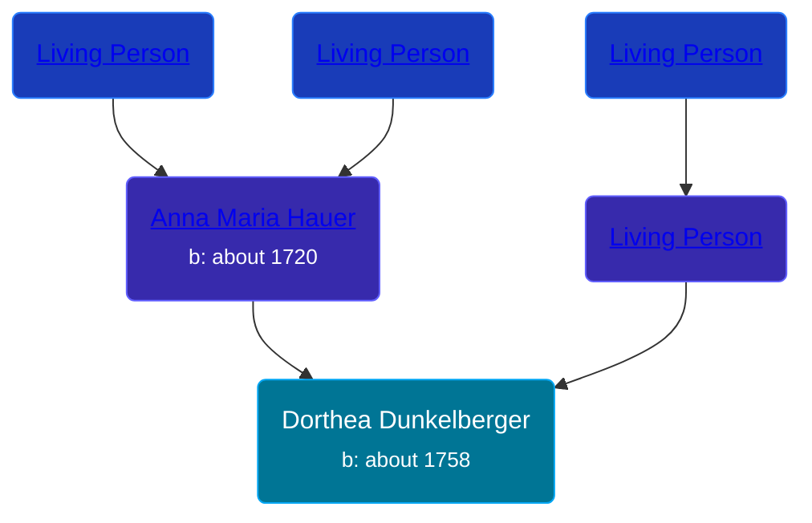

## 🟣 Dorthea Dunkelberger

Daughter of [Living Person](/people/1/13545057) and [Anna Maria Hauer](/people/2/22963774)





### 📆 Events


Type | Date | Age at Event | Place
------ | ------ | ------ | ------
[Birth](#event-event-2) | about 1758 |  |



- **[Birth](#event-event-2)**
**Date**: about 1758, Age:
**Place**:


### 📰 Event Sources

####  Birth, about 1758
* The Dunkelberger Family: Europe to America, 1600-1982