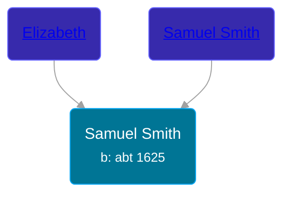

## 🔵 Samuel Smith

Son of [Samuel Smith](/people/8/86804391) and [Elizabeth ](/people/7/71389724)





### 📆 Events


Type | Date | Age at Event | Place
------ | ------ | ------ | ------
[Birth](#event-event-2) | abt 1625 |  |



- **[Birth](#event-event-2)**
**Date**: abt 1625, Age:
**Place**:


### 📰 Event Sources

####  Birth, abt 1625
* History of the Town of Sunderland, Massachusetts  - 532