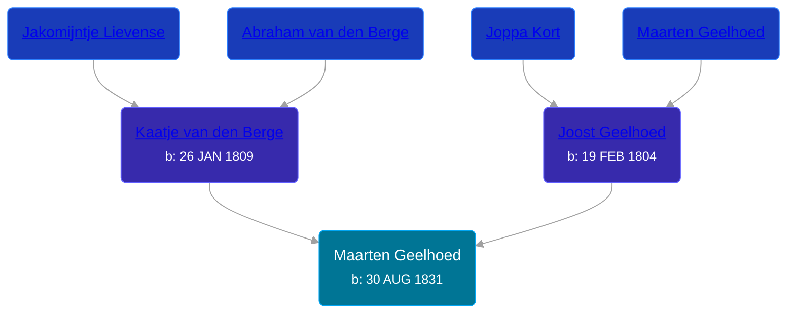

## 🔵 Maarten Geelhoed
<small>Age: 2m, 23d</small>

Son of [Joost Geelhoed](/people/7/72031888) and [Kaatje van den Berge](/people/3/32271874)





### 📆 Events


Type | Date | Age at Event | Place
------ | ------ | ------ | ------
[Birth](#event-event-2) | 30 AUG 1831 |  | Dreischor, Zeeland, Netherlands
[Death](#event-event-3) | 23 NOV 1831 | 2m, 23d | Dreischor, Zeeland, Netherlands



- **[Birth](#event-event-2)**
**Date**: 30 AUG 1831, Age:
**Place**: Dreischor, Zeeland, Netherlands
- **[Death](#event-event-3)**
**Date**: 23 NOV 1831, Age: 2m, 23d
**Place**: Dreischor, Zeeland, Netherlands


### 📰 Event Sources

####  Birth, 30 AUG 1831
* Geelhoet, Geelhoed & Geelhoedt Genealogie

####  Death, 23 NOV 1831
* Geelhoet, Geelhoed & Geelhoedt Genealogie