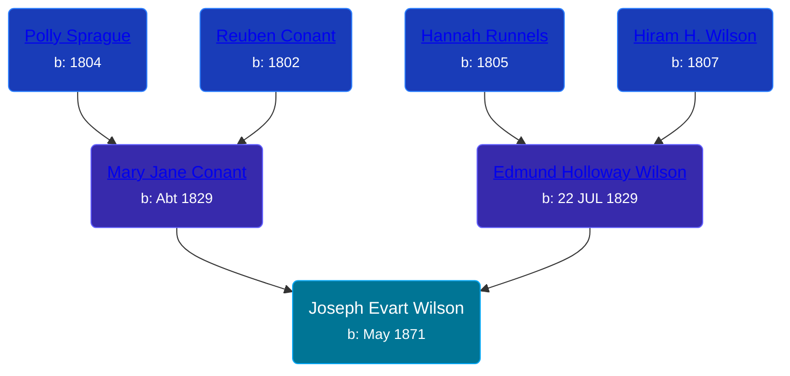

## 🔵 Joseph Evart Wilson
<small>Age: 80y, 3m, 16d</small>

Son of [Edmund Holloway Wilson](/people/6/67777324) and [Mary Jane Conant](/people/2/27722232)





### 📆 Events


Type | Date | Age at Event | Place
------ | ------ | ------ | ------
[Birth](#event-event-2) | May 1871 |  | Ottawa, Michigan, USA
[Residence](#event-event-0) | Jun 1880 | 9y, 1m | Robinson Township, Ottawa, Michigan, USA
[Residence](#event-event-1) | 1894 | 22y, 7m | Tyrone Township, Kent, Michigan, USA
[Residence](#event-event-2) | 14 JUN 1900 | 29y, 1m, 14d | Tyrone Township, Kent, Michigan, USA
[Residence](#event-event-3) | 08 MAY 1910 | 39y, 8d | Tyrone Township, Kent, Michigan, USA
[Residence](#event-event-4) | 03 APR 1930 | 58y, 11m, 3d | Rio Grande, Colorado, USA
[Residence](#event-event-5) | 1935 | 63y, 7m | Grand Rapids, Kent, Michigan, United States
[Residence](#event-event-6) | 22 APR 1940 | 68y, 11m, 22d | Grand Rapids, Kent, Michigan, United States
[Residence](#event-event-7) | 18 APR 1950 | 78y, 11m, 18d | Grand Rapids, Kent, Michigan, United States
[Death](#event-event-11) | 16 AUG 1951 | 80y, 3m, 16d | Grand Rapids, Kent, Michigan, United States
Burial |  |  | Chapel Hill Memorial Gardens, Grand Rapids, Kent, Michigan, United States



- **[Birth](#event-event-2)**
**Date**: May 1871, Age:
**Place**: Ottawa, Michigan, USA
- **[Residence](#event-event-0)**
**Date**: Jun 1880, Age: 9y, 1m
**Place**: Robinson Township, Ottawa, Michigan, USA
- **[Residence](#event-event-1)**
**Date**: 1894, Age: 22y, 7m
**Place**: Tyrone Township, Kent, Michigan, USA
- **[Residence](#event-event-2)**
**Date**: 14 JUN 1900, Age: 29y, 1m, 14d
**Place**: Tyrone Township, Kent, Michigan, USA
- **[Residence](#event-event-3)**
**Date**: 08 MAY 1910, Age: 39y, 8d
**Place**: Tyrone Township, Kent, Michigan, USA
- **[Residence](#event-event-4)**
**Date**: 03 APR 1930, Age: 58y, 11m, 3d
**Place**: Rio Grande, Colorado, USA
- **[Residence](#event-event-5)**
**Date**: 1935, Age: 63y, 7m
**Place**: Grand Rapids, Kent, Michigan, United States
- **[Residence](#event-event-6)**
**Date**: 22 APR 1940, Age: 68y, 11m, 22d
**Place**: Grand Rapids, Kent, Michigan, United States
- **[Residence](#event-event-7)**
**Date**: 18 APR 1950, Age: 78y, 11m, 18d
**Place**: Grand Rapids, Kent, Michigan, United States
- **[Death](#event-event-11)**
**Date**: 16 AUG 1951, Age: 80y, 3m, 16d
**Place**: Grand Rapids, Kent, Michigan, United States
- **Burial**
**Date**:
**Place**: Chapel Hill Memorial Gardens, Grand Rapids, Kent, Michigan, United States


## 👩‍❤️‍👨 Relationships

### 🟣 [Orpha Ann Hyde](/people/6/63932813), b. 24 OCT 1886

#### Events


Type | Date | Age at Event | Place
------ | ------ | ------ | ------
[Marriage](#event-family-0-event-0) | 14 AUG 1903 | 32y, 3m, 14d | Newaygo, Newaygo, Michigan, USA
[Divorce](#event-family-0-event-1) | 05 FEB 1920 | 48y, 9m, 5d | Kent, Michigan, USA



- **[Marriage](#event-family-0-event-0)**
**Date**: 14 AUG 1903, Age: 32y, 3m, 14d
**Place**: Newaygo, Newaygo, Michigan, USA
- **[Divorce](#event-family-0-event-1)**
**Date**: 05 FEB 1920, Age: 48y, 9m, 5d
**Place**: Kent, Michigan, USA


#### Children With Orpha Ann Hyde
* 🔵 [Clifford Lynn Wilson](/people/4/42196820), b. 23 APR 1904
* 🔵 [James Wilson](/people/1/17213544), b. 1905
* 🔵 [Phillip F Wilson](/people/4/42836476), b. 23 JUL 1905
* 🔵 [Living Person](/people/3/35616804)
* 🔵 [Lawrence A. Wilson](/people/8/86477632), b. 15 JUN 1911
* 🔵 [Fletcher Maxwell Wilson](/people/3/32597724), b. 03 JUN 1913
* 🟣 [Living Person](/people/7/74548303)
## 📝 Notes
>   
  > Joseph lists himself as "widowed" in the 1930 census, even though his former wife who divorced him for "extreme cruetly" was still alive.
### 📰 Event Sources

####  Birth, May 1871
* Michigan, Death Records, 1867-1950

####  Residence, Jun 1880
* 1880 US Census

####  Residence, 1894
* 1894 Michigan State Census

####  Residence, 14 JUN 1900
* 1900 US Census
>   
  > Name: Joseph E Wilson  
  > Age: 29  
  > Birth Date: May 1871  
  > Birthplace: Michigan, USA  
  > Home in 1900: Tyrone, Kent, Michigan  
  > Sheet Number: 12  
  > Number of Dwelling in Order of Visitation: 163  
  > Family Number: 163  
  > Race: White  
  > Gender: Male  
  > Relation to Head of House: Son  
  > Marital Status: Single  
  > Father's Name: Edmond H Wilson  
  > Father's Birthplace: Massachusetts, USA  
  > Mother's Birthplace: New York, USA  
  > Occupation: Farmer  
  > Months Not Employed: 0  
  > Can Read: Yes  
  > Can Write: Yes  
  > Can Speak English: Yes  
  > House Owned or Rented: Own  
  > Home Free or Mortgaged: F  
  > Farm or House: F  
  >   
  > Household members (Name: Age)  
  > Edmond H Wilson: 70  
  > Joseph E Wilson: 29

####  Marriage, 14 AUG 1903
* Michigan, Marriage Records, 1867-1952
>   
  > Name: Orpha A Hyde  
  > Gender: Female  
  > Race: White  
  > Birth Year: abt 1887  
  > Birth Place: Michigan  
  > Marriage Date: 14 Aug 1903  
  > Marriage Place: Newaygo, Newaygo, Michigan, USA  
  > Age: 16  
  > Residence Place: Grant T P  
  > Father: John L Hyde  
  > Mother: M J Siddall  
  > Spouse: Joseph E Wilson  
  > Spouse Gender: Male  
  > Spouse Race: White  
  > Spouse Age: 32  
  > Spouse Birth Place: Michigan  
  > Spouse Residence Place: Grant T P  
  > Spouse Father: E H Wilson  
  > Spouse Mother: Mary Conant  
  > Record Number: 2569  
  > Film: 79  
  > Film Description: 1903 Menominee - 1903 Washtenaw

####  Residence, 08 MAY 1910
* 1910 US Census
>   
  > Name: Joseph Nelson  
  > Age in 1910: 37  
  > Birth Date: 1873  
  > Birthplace: Michigan  
  > Home in 1910: Tyrone, Kent, Michigan, USA  
  > Race: White  
  > Gender: Male  
  > Relation to Head of House: Head  
  > Marital Status: Married  
  > Spouse's Name: Orpha Wilson  
  > Father's Name: Edd Wilson  
  > Father's Birthplace: New York  
  > Mother's Birthplace: New York  
  > Native Tongue: English  
  > Occupation: Farmer  
  > Industry: Farm  
  > Employer, Employee or Other: Wage Earner  
  > Home Owned or Rented: Own  
  > Home Free or Mortgaged: Free  
  > Farm or House: House  
  > Able to read: Yes  
  > Able to Write: Yes  
  > Years Married: 7  
  > Out of Work: N  
  > Number of Weeks Out of Work: 0  
  >   
  > Household members (Name: Age)  
  > Edd Wilson: 81  
  > Joseph Nelson: 37  
  > Orpha Wilson: 24  
  > Clifford Wilson: 6  
  > Joseph Wilson: 3

####  Divorce, 05 FEB 1920
* Michigan, Divorce Records, 1897-1952
>   
  > Name: Joseph E Wilson  
  > Marriage Date: 14 Aug 1903  
  > Marriage Place: Newaggo Michigan  
  > Decree Date: 5 Feb 1920  
  > Decree Place: Kent  
  > Spouse Name: Orpha A Wilson  
  > Cause: Extreme Cruelty  
  > State File Number: 22418  
  > Divorce Status: Granted

####  Residence, 03 APR 1930
* 1930 US Census
>   
  > Name: Joseph E Wilson  
  > Birth Year: 1872  
  > Gender: Male  
  > Race: White  
  > Age in 1930: 58  
  > Birthplace: Michigan  
  > Marital Status: Widowed  
  > Relation to Head of House: Head  
  > Homemaker?: Yes  
  > Home in 1930: Precinct 5, Rio Grande, Colorado, USA  
  > Map of Home: Precinct 5,Rio Grande,Colorado  
  > Street Address: Experiment Station Road  
  > Dwelling Number: 11  
  > Family Number: 12  
  > Home Owned or Rented: Rented  
  > Home Value: 15.  
  > Radio Set: No  
  > Age at First Marriage: 32  
  > Attended School: No  
  > Able to Read and Write: Yes  
  > Father's Birthplace: Massachusetts  
  > Mother's Birthplace: Canada  
  > Able to Speak English: Yes  
  > Occupation: Farm laborer  
  > Industry: Farm  
  > Class of Worker: Wage or salary worker  
  >   
  > Household members (Name: Age)  
  > Joseph E Wilson: 58  
  > Maxwell Wilson: 17

####  Residence, 1935
* 1940 US Census

####  Residence, 22 APR 1940
* 1940 US Census
>   
  > Name: Joseph Wilson  
  > Respondent: Yes  
  > Age: 72  
  > Estimated Birth Year: abt 1868  
  > Gender: Male  
  > Race: White  
  > Birthplace: Michigan  
  > Marital Status: Single  
  > Relation to Head of House: Head  
  > Home in 1940: Grand Rapids, Kent, Michigan  
  > House Number: 335 1/2  
  > Inferred Residence in 1935: Grand Rapids, Kent, Michigan  
  > Residence in 1935: Grand Rapids  
  > Sheet Number: 6A  
  > Number of Household in Order of Visitation: 151  
  > House Owned or Rented: Rented  
  > Value of Home: 10  
  > Attended School or College: No  
  > Highest Grade Completed: Elementary school, 4th grade  
  > Income Other Sources: Yes  
  >   
  > Only member listed in household

####  Residence, 18 APR 1950
* 1950 US Census
>   
  > Name: Joseph E Wilson  
  > Age: 79  
  > Birth Date: abt 1871  
  > Gender: Male  
  > Race: White  
  > Birth Place: Michigan  
  > Marital Status: Divorced  
  > Relation to Head of House: Head  
  > Residence Date: 1950  
  > Home in 1950: Grand Rapids, Kent, Michigan, USA  
  > Street Name: Broadway  
  > Apartment Number: 411  
  > Dwelling Number: 402  
  > Farm: No  
  > Acres: No  
  > Inferred Previous Residence Place:   
  > Father Birth Place: USA  
  > Mother Birth Place: USA  
  > Occupation Category: Unable to Work  
  > Same House: Yes  
  > Veteran: No  
  >   
  > Living with two other elderly men listed as partners, all of whom are also unable to work.  
  >
####  Death, 16 AUG 1951
* The Grand Rapids Herald  - 8/17/1951
>   
  > WILSON -- Joseph E. Wilson, aged 80, of 416 Third St. NW., passed awaysuddenly Thursday evening at Butterworth Hospital. He is survived by one daughter, Mrs. George Andrew Cree; four sons, Clifford L., Joseph E. Wilson, Jr., Lawrence A. and Fletcher M. Wilson, all of Grand Rapids; fourteen grandchildren, and one great-grandchild. Mr. Wilson reposes at the VanStrien-Alman Funeral Home, where services will be held at 2 o'clock Monday afternoon. Interment Chapel Hill Memorial Gardens.
* Michigan, Death Records, 1867-1950
>   
  > Name: Joseph Evart Wilson Sr  
  > Gender: Male  
  > Marital Status: Divorced  
  > Birth Date: May, 1871  
  > Birth Place: Ottawa County, Michigan  
  > Death Date: 16 Aug 1951  
  > Death Place: Grand Rapids, Kent, Michigan, USA  
  > Death Age: 80  
  > File Number: 053241  
  > Father: Edmund E Wilson  
  > Mother: Mary Conant
