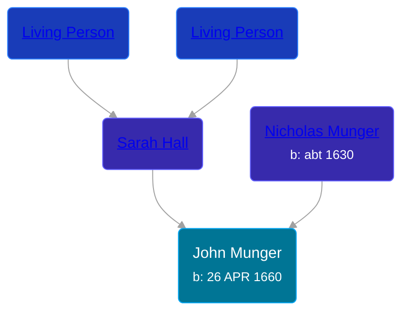

## 🔵 John Munger

Son of [Nicholas Munger](/people/4/40603656) and [Sarah Hall](/people/4/42804920)





### 📆 Events


Type | Date | Age at Event | Place
------ | ------ | ------ | ------
[Birth](#event-event-2) | 26 APR 1660 |  | Guilford, Connecticut, USA
[Death](#event-event-3) |  |  | Guilford, Connecticut, USA



- **[Birth](#event-event-2)**
**Date**: 26 APR 1660, Age:
**Place**: Guilford, Connecticut, USA
- **[Death](#event-event-3)**
**Date**:
**Place**: Guilford, Connecticut, USA


### 📰 Event Sources

####  Birth, 26 APR 1660
* The Munger Book  - xvi

####  Death
* The Munger Book  - 1
* Families of Early Guilford, Connecticut, Vol. II  - 833