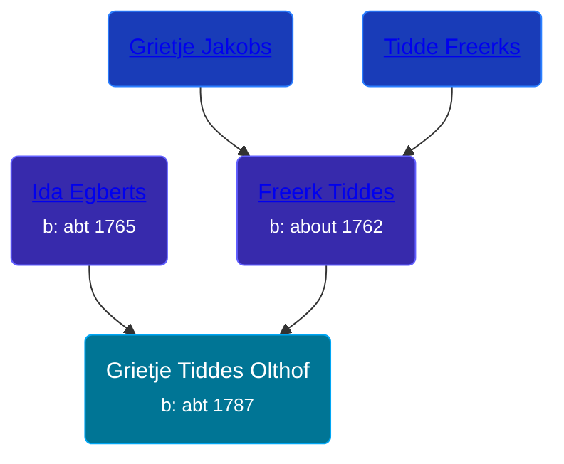

## 🟣 Grietje Tiddes Olthof
<small>Age: 72y, 12m, 5d</small>

Daughter of [Freerk Tiddes](/people/2/21111317) and [Ida Egberts](/people/6/68075578)





### 📆 Events


Type | Date | Age at Event | Place
------ | ------ | ------ | ------
Birth | abt 1787 |  |
[Death](#event-event-3) | 05 DEC 1859 | 72y, 12m, 5d | Appingedam, Netherlands



- **Birth**
**Date**: abt 1787, Age:
**Place**:
- **[Death](#event-event-3)**
**Date**: 05 DEC 1859, Age: 72y, 12m, 5d
**Place**: Appingedam, Netherlands


### 📰 Event Sources

####  Death, 05 DEC 1859
* Dutch Civil Register
>   
  > Source Civil register - Death  
  > Archive location: Groninger Archieven  
  > GeneralMunicipality: Appingedam  
  > Type of record: overlijden  
  > Record number: 124  
  > Registration date: 06-12-1859  
  > Deceased: Grietje Olthof  
  > Gender: V  
  > Date of death: 05-12-1859  
  > Age: 72  
  > Place of death: Appingedam  
  > Father: Freerk Tiddes  
  > Mother: Ida Egberts  
  > Additional information: geboortepl: Zeerijp gem. 't Zandt
