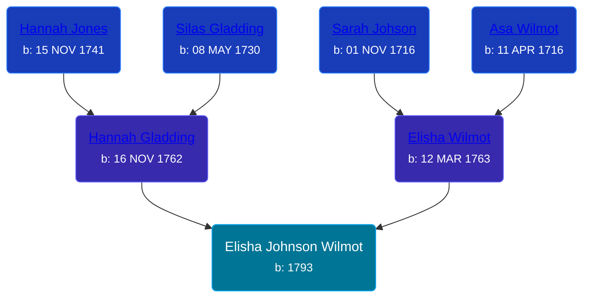

## 🔵 Elisha Johnson Wilmot

Son of [Elisha Wilmot](/people/2/21177328) and [Hannah Gladding](/people/8/88055086)





### 📆 Events


Type | Date | Age at Event | Place
------ | ------ | ------ | ------
[Birth](#event-event-2) | 1793 |  | Wallingford, Connecticut, USA



- **[Birth](#event-event-2)**
**Date**: 1793, Age:
**Place**: Wallingford, Connecticut, USA


### 📰 Event Sources

####  Birth, 1793
* Genealogy: A Journal of American Ancestry  - 29