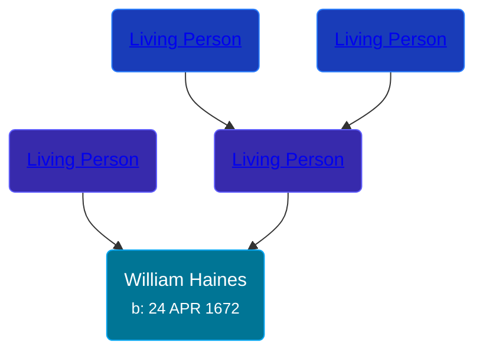

## 🔵 William Haines
<small>Age: 82y, 5d</small>

Son of [Living Person](/people/2/25122588) and [Living Person](/people/5/57067327)





### 📆 Events


Type | Date | Age at Event | Place
------ | ------ | ------ | ------
Birth | 24 APR 1672 |  | Aynhoe, Northamptonshire, England
[Death](#event-event-3) | 29 APR 1754 | 82y, 5d | Northampton, Burlington, New Jersey, USA



- **Birth**
**Date**: 24 APR 1672, Age:
**Place**: Aynhoe, Northamptonshire, England
- **[Death](#event-event-3)**
**Date**: 29 APR 1754, Age: 82y, 5d
**Place**: Northampton, Burlington, New Jersey, USA


## 👩‍❤️‍👨 Relationships

### 🟣 [Sarah Paine](/people/6/64473277), b. 1678

#### Children With Sarah Paine
* 🔵 [Nathan Haines](/people/7/74064515), b. 19 SEP 1702
### 📰 Event Sources

####  Death, 29 APR 1754
* Ancestry of George W. Bush
