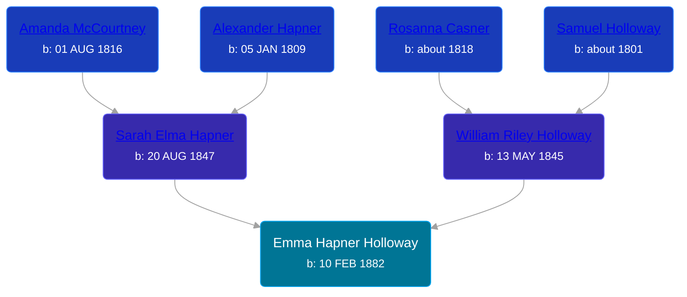

## 🟣 Emma Hapner Holloway
<small>Age: 80y, 6m, 14d</small>

Daughter of [William Riley Holloway](/people/9/90949012) and [Sarah Elma Hapner](/people/2/20173654)





### 📆 Events


Type | Date | Age at Event | Place
------ | ------ | ------ | ------
Birth | 10 FEB 1882 |  | Deerfield Township, Isabella, Michigan, USA
Death | 24 AUG 1962 | 80y, 6m, 14d | Winn, Isabella, Michigan, USA



- **Birth**
**Date**: 10 FEB 1882, Age:
**Place**: Deerfield Township, Isabella, Michigan, USA
- **Death**
**Date**: 24 AUG 1962, Age: 80y, 6m, 14d
**Place**: Winn, Isabella, Michigan, USA

