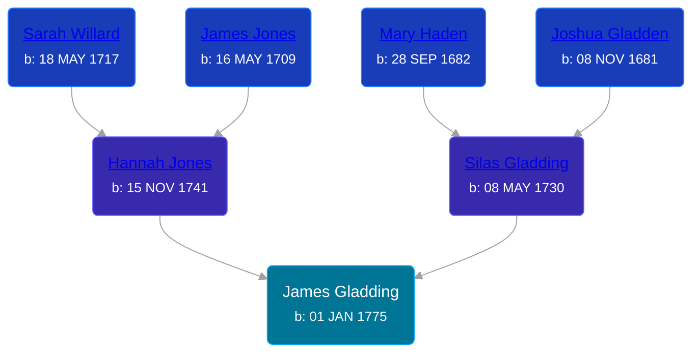

## 🔵 James Gladding

Son of [Silas Gladding](/people/5/55129348) and [Hannah Jones](/people/3/3592220)





### 📆 Events


Type | Date | Age at Event | Place
------ | ------ | ------ | ------
Birth | 01 JAN 1775 |  |



- **Birth**
**Date**: 01 JAN 1775, Age:
**Place**:

