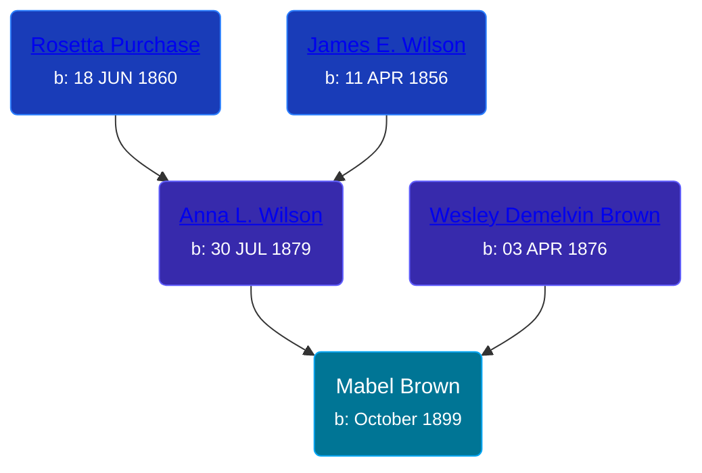

## 🟣 Mabel Brown

Daughter of [Wesley Demelvin Brown](/people/5/52698666) and [Anna L. Wilson](/people/7/73378674)





### 📆 Events


Type | Date | Age at Event | Place
------ | ------ | ------ | ------
Birth | October 1899 |  | Michigan, USA
[Residence](#event-event-0) | 01 JUN 1900 | 8m, 1d | Manistee, Manistee, Michigan, USA



- **Birth**
**Date**: October 1899, Age:
**Place**: Michigan, USA
- **[Residence](#event-event-0)**
**Date**: 01 JUN 1900, Age: 8m, 1d
**Place**: Manistee, Manistee, Michigan, USA


### 📰 Event Sources

####  Residence, 01 JUN 1900
* 1900 US Census
