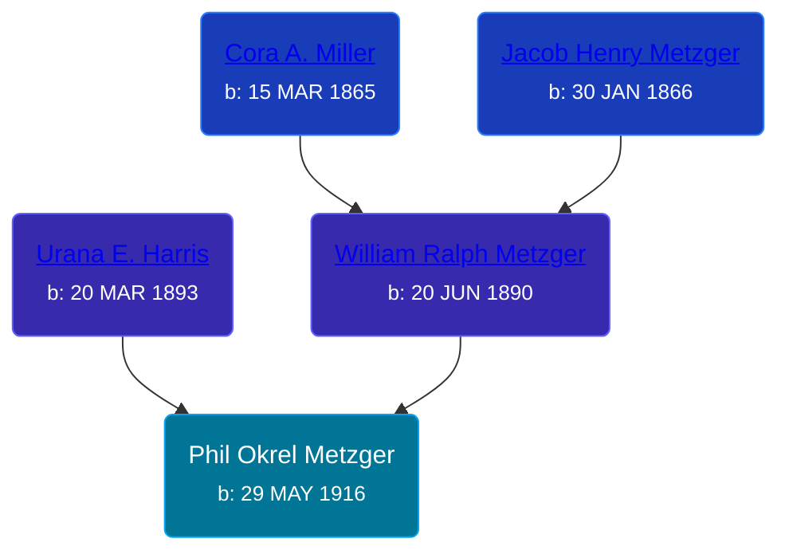

## 🔵 Phil Okrel Metzger
<small>Age: 77y, 8m, 1d</small>

Son of [William Ralph Metzger](/people/6/66898263) and [Urana E. Harris](/people/8/8274504)





### 📆 Events


Type | Date | Age at Event | Place
------ | ------ | ------ | ------
[Birth](#event-event-2) | 29 MAY 1916 |  | Churubusco, Whitley, Indiana, USA
[Residence](#event-event-0) | 12 JAN 1920 | 3y, 7m, 13d | Columbia, Whitley, Indiana, USA
[Residence](#event-event-1) | 14 MAY 1930 | 13y, 11m, 15d | Dorr Township, Allegan, Michigan, USA
[Death](#event-event-5) | 30 JAN 1994 | 77y, 8m, 1d | Fort Wayne, Allen, Indiana, USA
[Burial](#event-event-6) |  |  | Thorn Cemetery, Noble, Indiana, USA



- **[Birth](#event-event-2)**
**Date**: 29 MAY 1916, Age:
**Place**: Churubusco, Whitley, Indiana, USA
- **[Residence](#event-event-0)**
**Date**: 12 JAN 1920, Age: 3y, 7m, 13d
**Place**: Columbia, Whitley, Indiana, USA
- **[Residence](#event-event-1)**
**Date**: 14 MAY 1930, Age: 13y, 11m, 15d
**Place**: Dorr Township, Allegan, Michigan, USA
- **[Death](#event-event-5)**
**Date**: 30 JAN 1994, Age: 77y, 8m, 1d
**Place**: Fort Wayne, Allen, Indiana, USA
- **[Burial](#event-event-6)**
**Date**:
**Place**: Thorn Cemetery, Noble, Indiana, USA


## 👩‍❤️‍👨 Relationships

### 🟣 [Living Person](/people/8/85561305)

#### Children With Living Person
* 🟣 [Living Person](/people/3/35610560)
* 🟣 [Living Person](/people/8/89832710)
### 📰 Event Sources

####  Birth, 29 MAY 1916
* Indiana, Birth Certificates, 1907-1940
>   
  > Name:Phil Okrel Metzger  
  > Gender:Male  
  > Birth Date:29 May 1916  
  > Birth Place:Churubusco, Whitley, Indiana, USA  
  > Registration Year:1916  
  > Father:W. R. Metzger  
  > Mother:Urana E. Harris  
  > Certificate Number:65229  
  > Roll number:026  
  > Agency:Indiana State Dept. of Health  
  > Volume Range:1101 - 1107

####  Residence, 12 JAN 1920
* 1920 US Census

####  Residence, 14 MAY 1930
* 1930 US Census

####  Death, 30 JAN 1994
* U.S., Social Security Death Index, 1935-2014
>   
  > Name: PHIL O METZGER  
  > Birth Date: 29 May 1916  
  > Death Date: 30 Jan 1994  
  > Last Residence: 46818 (Fort Wayne, Allen, IN)  
  > Last Benefit: (none specified)  
  > SSN: ###-##-####  
  > Issued: Michigan
* Indiana, Death Certificates, 1899-2011
>   
  > Name:Phil O Metzger  
  > Gender:Male  
  > Race:White  
  > Age:77  
  > Birth Date:29 May 1916  
  > Birth Place:Churubusco, Indiana  
  > Death Date:30 Jan 1994  
  > Death Place:Fort Wayne, Allen, Indiana, USA  
  > Marital Status:Married  
  > Spouse:Ellen R Metzger  
  > Father:Ralph Metzger  
  > Mother:Urana Harris
* U.S., Social Security Applications and Claims Index, 1936-2007
>   
  > Name:Phil Okrel Metsger  
  > [Phil O Metzger]   
  > SSN:368093519  
  > Gender:Male  
  > Race:White  
  > Birth Date:29 May 1916  
  > Birth Place:Churobusco, Indiana  
  > Death Date:30 Jan 1994  
  > Father:Wm R Metzger  
  > Mother:Urana E Harris  
  > Type of Claim:Original SSN.  
  > Notes:Nov 1936: Name listed as PHIL OKREL METSGER; 08 Feb 1994: Name listed as PHIL O METZGER

####  Burial
* findagrave.com