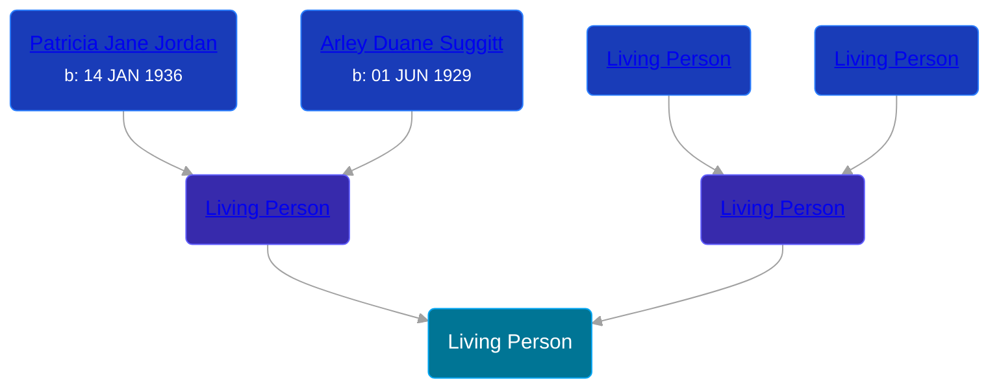

## 🔵 Living Person

Son of [Living Person](/people/3/34056238) and [Living Person](/people/1/19693317)



```mermaid
graph
classDef grands fill:#193cb8,stroke:#2b7fff,stroke-width:1px,color:#fff;
classDef parents fill:#372aac,stroke:#615fff,stroke-width:1px,color:#fff;
classDef primary fill:#007595,stroke:#00a6f4,stroke-width:1px,color:#fff;
59053596(Living Person):::primary
19693317(<a class="text-white" href="/people/1/19693317">Living Person</a>):::parents-->59053596
8578400(<a class="text-white" href="/people/8/8578400">Patricia Jane Jordan</a><br /><small>b: 14 JAN 1936</small>):::grands-->19693317
91694885(<a class="text-white" href="/people/9/91694885">Arley Duane Suggitt</a><br /><small>b: 01 JUN 1929</small>):::grands-->19693317
34056238(<a class="text-white" href="/people/3/34056238">Living Person</a>):::parents-->59053596
27090454(<a class="text-white" href="/people/2/27090454">Living Person</a>):::grands-->34056238
28832046(<a class="text-white" href="/people/2/28832046">Living Person</a>):::grands-->34056238
linkStyle default stroke:#a1a1a1
```

