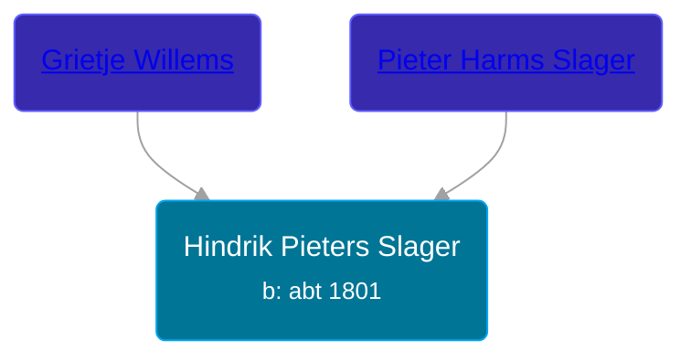

## 🔵 Hindrik Pieters Slager

Son of [Pieter Harms Slager](/people/2/21685798) and [Grietje Willems](/people/6/63361989)





### 📆 Events


Type | Date | Age at Event | Place
------ | ------ | ------ | ------
Birth | abt 1801 |  | Stedum, Netherlands



- **Birth**
**Date**: abt 1801, Age:
**Place**: Stedum, Netherlands


## 👩‍❤️‍👨 Relationships

### 🟣 [Trijnje Freerks Olthof](/people/5/5004158), b. abt 1799

#### Events


Type | Date | Age at Event | Place
------ | ------ | ------ | ------
[Marriage](#event-family-0-event-0) | 28 DEC 1822 | 21y, 12m, 28d | Stedum, Netherlands



- **[Marriage](#event-family-0-event-0)**
**Date**: 28 DEC 1822, Age: 21y, 12m, 28d
**Place**: Stedum, Netherlands


### 📰 Event Sources

####  Marriage, 28 DEC 1822
* Dutch Civil Register
>   
  > Groom: Hindrik Pieters Slager  
  > Profession (Groom): Boereknegt (peasant servant)  
  > Place of birth (Groom): Stedum  
  > Age (Groom): 21 jaar  
  >   
  > Bride: Trijnje Freerks Olthof  
  > Profession (Bride): boeremeid (peasant girl)  
  > Place of birth (Bride): Zeerijp  
  > Age (Bride): 23 jaar  
  >   
  > Father of the groom: Pieter Harms Slager  
  > Profession (Father of the groom): arbeider (worker)  
  >   
  > Mother of the groom: Grietje Willems  
  > Profession (Mother of the groom): Arbeidster (worker)  
  >   
  > Father of the bride: Freerk Tiddes Olthof  
  > Profession (Father of the bride): arbeider (worker)  
  >   
  > Mother of the bride: Ida Egberts  
  > Profession (Mother of the bride): Arbeidster (worker)  
  >   
  > Event: Huwelijk (wedding)  
  > Event date: 28-12-1822  
  > Event place: Stedum  
  >   
  > Document type: BS Huwelijk  
  > Heritage institution: Groninger Archieven  
  > Institution place: Groningen  
  > Collection region: Groningen  
  > Sourcenumber: 14  
  > Registration date: 28-12-1822  
  > Document place: Stedum  
  > Collection: Bron: boek, Periode: 1822  
  > Book: Huwelijksregister 1822  
  > AkteSoort: huwelijk  
  >