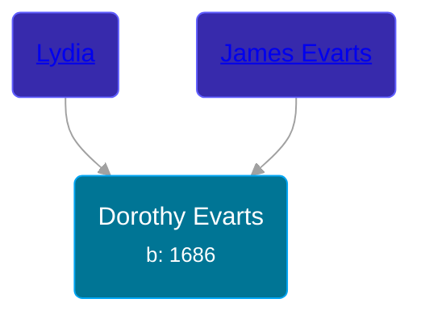

## 🟣 Dorothy Evarts

Daughter of [James Evarts](/people/8/86538784) and [Lydia ](/people/3/35247110)





### 📆 Events


Type | Date | Age at Event | Place
------ | ------ | ------ | ------
[Birth](#event-event-3) | 1686 |  |



- **[Birth](#event-event-3)**
**Date**: 1686, Age:
**Place**:


## 👩‍❤️‍👨 Relationships

### 🔵 [Samuel Munger](/people/6/64239804), b. 07 FEB 1690

#### Events


Type | Date | Age at Event | Place
------ | ------ | ------ | ------
[Marriage](#event-family-0-event-0) | 06 APR 1710 | 24y, 4m, 6d | Guilford, Connecticut, USA



- **[Marriage](#event-family-0-event-0)**
**Date**: 06 APR 1710, Age: 24y, 4m, 6d
**Place**: Guilford, Connecticut, USA


#### Children With Samuel Munger
* 🟣 [Living Person](/people/8/8047387)
* 🟣 [Living Person](/people/7/79164696)
* 🟣 [Submit Munger](/people/1/10597619), b. 05 JAN 1711
* 🔵 [Nathaniel Munger](/people/3/38968541), b. 05 OCT 1712
* 🔵 [Samuel Munger](/people/1/17676382), b. 05 OCT 1712
* 🔵 [Elnathan Munger](/people/3/39748505), b. 14 JUL 1714
* 🔵 [Joseph Munger](/people/4/48475708), b. JUL 1719
* 🟣 [Sarah Munger](/people/2/2457192), b. 1726
### 📰 Event Sources

####  Birth, 1686
* The Munger Book  - 203
* Families of Early Guilford, Connecticut, Vol. II  - 835
####  Marriage, 06 APR 1710
* The Munger Book  - 203
