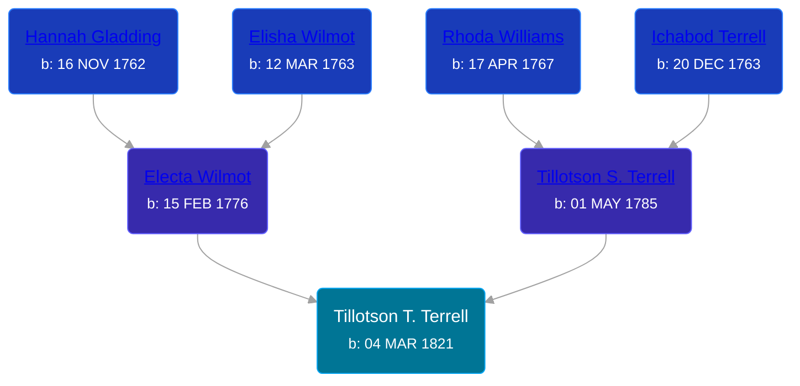

## 🔵 Tillotson T. Terrell
<small>Age: 78y, 10m, 19d</small>

Son of [Tillotson S. Terrell](/people/2/25548435) and [Electa Wilmot](/people/7/77370498)





### 📆 Events


Type | Date | Age at Event | Place
------ | ------ | ------ | ------
Birth | 04 MAR 1821 |  | Ohio, USA
[Residence](#event-event-0) | 1850 | 28y, 8m, 26d | LaGrange, Lorain, Ohio, USA
[Residence](#event-event-1) | 28 JUN 1860 | 39y, 3m, 24d | Byron Township, Kent, Michigan, USA
[Residence](#event-event-2) | 16 AUG 1870 | 49y, 5m, 12d | Paris Township, Kent, Michigan, USA
[Residence](#event-event-3) | 1880 | 58y, 8m, 26d | Byron Township, Kent, Michigan, USA
[Death](#event-event-7) | 23 JAN 1900 | 78y, 10m, 19d | Paris Township, Kent, Michigan, USA
[Burial](#event-event-8) |  |  | Winchester Cemetery, Byron Township, Kent, Michigan, USA



- **Birth**
**Date**: 04 MAR 1821, Age:
**Place**: Ohio, USA
- **[Residence](#event-event-0)**
**Date**: 1850, Age: 28y, 8m, 26d
**Place**: LaGrange, Lorain, Ohio, USA
- **[Residence](#event-event-1)**
**Date**: 28 JUN 1860, Age: 39y, 3m, 24d
**Place**: Byron Township, Kent, Michigan, USA
- **[Residence](#event-event-2)**
**Date**: 16 AUG 1870, Age: 49y, 5m, 12d
**Place**: Paris Township, Kent, Michigan, USA
- **[Residence](#event-event-3)**
**Date**: 1880, Age: 58y, 8m, 26d
**Place**: Byron Township, Kent, Michigan, USA
- **[Death](#event-event-7)**
**Date**: 23 JAN 1900, Age: 78y, 10m, 19d
**Place**: Paris Township, Kent, Michigan, USA
- **[Burial](#event-event-8)**
**Date**:
**Place**: Winchester Cemetery, Byron Township, Kent, Michigan, USA


## 👩‍❤️‍👨 Relationships

### 🟣 [Almira Munger](/people/3/36419408), b. 25 SEP 1827

#### Events


Type | Date | Age at Event | Place
------ | ------ | ------ | ------
[Marriage](#event-family-0-event-0) | 28 MAY 1850 | 29y, 2m, 24d | Lorain, Ohio, USA



- **[Marriage](#event-family-0-event-0)**
**Date**: 28 MAY 1850, Age: 29y, 2m, 24d
**Place**: Lorain, Ohio, USA


#### Children With Almira Munger
* 🔵 [Sherman A. Terrell](/people/6/61267132), b. 19 MAY 1851
* 🟣 [Rosetta Avrilla Terrell](/people/8/84698967), b. 08 JUL 1853
* 🔵 [Curtland Terrell](/people/4/47972604), b. Aug 1856
* 🔵 [Franklin T. Terrell](/people/1/12166472), b. 11 OCT 1860
### 📰 Event Sources

####  Residence, 1850
* 1850 US Census

####  Residence, 28 JUN 1860
* 1860 US Census

####  Residence, 16 AUG 1870
* 1870 US Census

####  Residence, 1880
* 1880 US Census

####  Death, 23 JAN 1900
* Kent County Death Records  - Book 5, Page 234, Record 12769
>   
  > Name: T. Terrell  
  > Date of Death: 23 Jan 1900  
  > Date of Record: 21 Feb 1900  
  > Place of Death: Paris Township, Kent County, Michigan  
  > Cause of Death: Bright's Disease  
  > Age: 79 y, 10 m, 9 d  
  > Place of Birth: Ohio  
  > Occupation: Farmer  
  > Father: Tillotson Terrell  
  > Mother: Unknown

####  Burial
* Winchester Cemetery
>   
  > Name: Terrell, Tillotson  
  > Age: 80  
  > Burial: 24 Jan 1900

####  Marriage, 28 MAY 1850
* Ohio, County Marriages, 1774-1993
>   
  > Name: Tillotan Terrell  
  > Gender: Male  
  > Marriage Date: 23 May 1850  
  > Marriage Place: Lorain, Ohio, USA  
  > Spouse: Almira Menger  
  > Gender: Female  
  > Film Number: 000447523