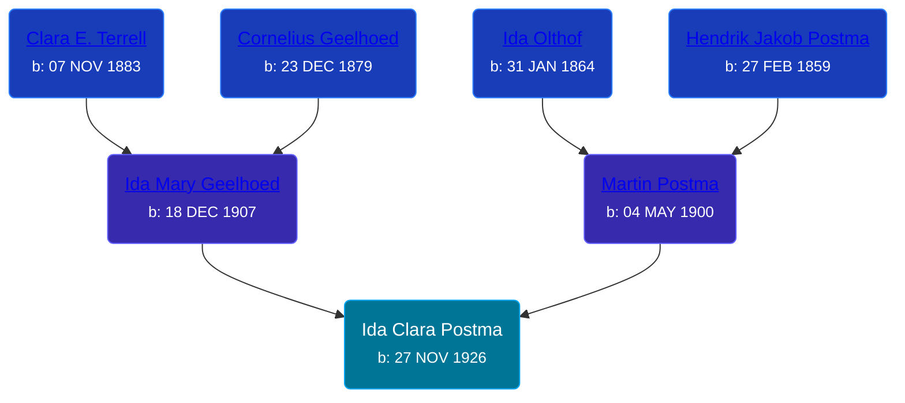

## 🟣 Ida Clara Postma
<small>Age: 60y, 5d</small>

Daughter of [Martin Postma](/people/7/7474832) and [Ida Mary Geelhoed](/people/1/11612484)





### 📆 Events


Type | Date | Age at Event | Place
------ | ------ | ------ | ------
Birth | 27 NOV 1926 |  | Michigan, USA
[Residence](#event-event-0) | 21 APR 1930 | 3y, 4m, 24d | Paris Township, Kent, Michigan, USA
[Death](#event-event-5) | 02 DEC 1986 | 60y, 5d | Georgetown, Ottawa, Michigan, USA
Burial |  |  | Rest Lawn Memorial Park, Grand Rapids, Kent, Michigan, United States



- **Birth**
**Date**: 27 NOV 1926, Age:
**Place**: Michigan, USA
- **[Residence](#event-event-0)**
**Date**: 21 APR 1930, Age: 3y, 4m, 24d
**Place**: Paris Township, Kent, Michigan, USA
- **[Death](#event-event-5)**
**Date**: 02 DEC 1986, Age: 60y, 5d
**Place**: Georgetown, Ottawa, Michigan, USA
- **Burial**
**Date**:
**Place**: Rest Lawn Memorial Park, Grand Rapids, Kent, Michigan, United States


## 👩‍❤️‍👨 Relationships

### 🔵 [Edward Jay Bowyer](/people/8/84507710), b. 04 AUG 1926

#### Children With Edward Jay Bowyer
* 🟣 [Living Person](/people/7/73124260)
* 🔵 [Living Person](/people/6/68090799)
* 🔵 [Living Person](/people/2/23303320)
* 🔵 [Living Person](/people/9/91972527)
* 🔵 [Living Person](/people/4/47858320)
* 🟣 [Living Person](/people/2/2785628)
### 📰 Event Sources

####  Residence, 21 APR 1930
* 1930 US Census
>   
  > Name: Ida C Postma  
  > Birth Year: abt 1927  
  > Gender: Female  
  > Race: White  
  > Age in 1930: 3  
  > Birthplace: Michigan  
  > Marital Status: Single  
  > Relation to Head of House: Daughter  
  > Home in 1930: Paris, Kent, Michigan, USA  
  > Street Address: Janet Street  
  > House Number: 352  
  > Dwelling Number: 443  
  > Family Number: 443  
  > Attended School: No  
  > Father's Birthplace: Michigan  
  > Mother's Birthplace: Michigan  
  >   
  > Household members:  
  > Martin Postma, 29, Head  
  > Ida M Postma, 22, Wife  
  > Ida C Postma, 3, Daughter  
  > Leona I Postma, 1, Daughter  
  > Henry C Postma, 0, Son  
  >

####  Death, 02 DEC 1986
* U.S., Social Security Death Index, 1935-2014
>   
  > Name: IDA BOWYER  
  > Birth: 27 Nov 1926  
  > Death: Dec 1986  
  > Last Residence: 49509 (Grand Rapids, Kent, MI)  
  > Last Benefit: (none specified)  
  > SSN: ###-##-####  
  > Issued: Michigan
* Michigan Deaths, 1971-1996
>   
  > Name:  Ida C Bowyer  
  > Birth Date: 27 Nov 1926  
  > Death Date: 2 Dec 1986  
  > Gender: Female  
  > Residence: Georgetown, Ottawa, Michigan  
  > Place of Death: Georgetown, Ottawa, Michigan
* The Grand Rapids Press  - 12/3/1986
>   
  > BOWYER -- Mrs. Ida C Bowyer, aged 60, of Jenison, passed away Tuesday,December 2, 1986. Surviving are her children, Robert Bowyer, James and Linda Cleveland, Dick and Connie Krzeminski, Terry and Sue Bowyer, Edward and Julie Bowyer, Martin John and Michele Bowyer, all of the Grand Rapids area; five grandchildren; five brothers, Henry and Marie Postma, Martin and Barbara Postma, Kenneth and Gail Postma, David and Lois Postma, Joe and Maureen Postma, all of the Grand Rapids area; a sister, Mrs. Daune (Martha) Wilson of Wyoming; several nieces and nephews.Funeral announcment later. Interment Restlawn Memorial Park.
