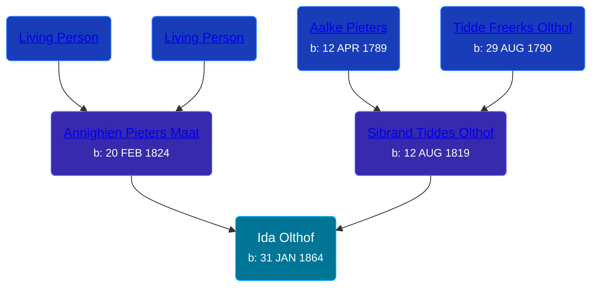

## 🟣 Ida Olthof
<small>Age: 74y, 10m, 1d</small>

Daughter of [Sibrand Tiddes Olthof](/people/7/76433820) and [Annighien Pieters Maat](/people/7/7249878)





### 📆 Events


Type | Date | Age at Event | Place
------ | ------ | ------ | ------
[Birth](#event-event-3) | 31 JAN 1864 |  | Loppersum, Netherlands
[Immigration](#event-event-0) | 02 MAY 1889 | 25y, 3m, 1d | New York, New York, United States
[Emigration](#event-event-1) | 1889 | 24y, 10m, -1d | Rotterdam, Netherlands
[Residence](#event-event-2) | 1894 | 29y, 10m, -1d | Gaines Township, Kent, Michigan, USA
[Residence](#event-event-3) | 29 JUN 1900 | 36y, 4m, 28d | Gaines Township, Kent, Michigan, USA
[Residence](#event-event-4) | 1910 | 45y, 10m, -1d | Gaines Township, Kent, Michigan, USA
[Residence](#event-event-5) | 14 JAN 1920 | 55y, 11m, 13d | Gaines Township, Kent, Michigan, USA
[Residence](#event-event-6) | 24 APR 1930 | 66y, 2m, 23d | Gaines Township, Kent, Michigan, USA
[Death](#event-event-11) | 02 DEC 1938 | 74y, 10m, 1d | Paris Township, Kent, Michigan, USA
[Burial](#event-event-12) | 05 DEC 1938 | 74y, 10m, 4d | Pine Hill Cemetery, Kentwood, Kent, Michigan, USA



- **[Birth](#event-event-3)**
**Date**: 31 JAN 1864, Age:
**Place**: Loppersum, Netherlands
- **[Immigration](#event-event-0)**
**Date**: 02 MAY 1889, Age: 25y, 3m, 1d
**Place**: New York, New York, United States
- **[Emigration](#event-event-1)**
**Date**: 1889, Age: 24y, 10m, -1d
**Place**: Rotterdam, Netherlands
- **[Residence](#event-event-2)**
**Date**: 1894, Age: 29y, 10m, -1d
**Place**: Gaines Township, Kent, Michigan, USA
- **[Residence](#event-event-3)**
**Date**: 29 JUN 1900, Age: 36y, 4m, 28d
**Place**: Gaines Township, Kent, Michigan, USA
- **[Residence](#event-event-4)**
**Date**: 1910, Age: 45y, 10m, -1d
**Place**: Gaines Township, Kent, Michigan, USA
- **[Residence](#event-event-5)**
**Date**: 14 JAN 1920, Age: 55y, 11m, 13d
**Place**: Gaines Township, Kent, Michigan, USA
- **[Residence](#event-event-6)**
**Date**: 24 APR 1930, Age: 66y, 2m, 23d
**Place**: Gaines Township, Kent, Michigan, USA
- **[Death](#event-event-11)**
**Date**: 02 DEC 1938, Age: 74y, 10m, 1d
**Place**: Paris Township, Kent, Michigan, USA
- **[Burial](#event-event-12)**
**Date**: 05 DEC 1938, Age: 74y, 10m, 4d
**Place**: Pine Hill Cemetery, Kentwood, Kent, Michigan, USA


## 👩‍❤️‍👨 Relationships

### 🔵 [Hendrik Jakob Postma](/people/3/31727152), b. 27 FEB 1859

#### Events


Type | Date | Age at Event | Place
------ | ------ | ------ | ------
[Marriage](#event-family-0-event-0) | 19 DEC 1889 | 25y, 10m, 18d | Grand Rapids, Kent, Michigan, United States



- **[Marriage](#event-family-0-event-0)**
**Date**: 19 DEC 1889, Age: 25y, 10m, 18d
**Place**: Grand Rapids, Kent, Michigan, United States


#### Children With Hendrik Jakob Postma
* 🟣 [Anna Postma](/people/9/95174357), b. 26 SEP 1890
* 🔵 [Sibrant Postma](/people/9/90958496), b. 15 FEB 1892
* 🟣 [Jennie Postma](/people/5/53448440), b. 17 MAY 1894
* 🔵 [Jacob Postma](/people/3/39791641), b. 12 OCT 1896
* 🔵 [Peter Postma](/people/7/79995198), b. 05 SEP 1898
* 🔵 [Martin Postma](/people/7/7474832), b. 04 MAY 1900
* 🔵 [Theodore Postma](/people/2/25196824), b. 20 MAY 1901
* 🔵 [Dewey Postma](/people/2/23665755), b. 01 JUN 1905
* 🟣 [Clara Postma](/people/3/37775298), b. 06 NOV 1906
* 🔵 [Charles J. Postma](/people/6/66045536), b. 10 JUL 1909
### 📰 Event Sources

####  Birth, 31 JAN 1864
* Netherlands, Birth Index, 1784-1917
>   
  > Child: Ida Olthof  
  > Birth date: 31-01-1864  
  > Birth place: Loppersum  
  > Gender: Vrouw  
  > Father: Sijbrand Tiddes Olthof  
  > Profession: daglooner  
  > Age: 44 jaar  
  > Mother: Annechien Pieters Maat  
  > Event: Geboorte  
  > Event date: 31-01-1864  
  > Event place: Loppersum  
  > Document type: BS Geboorte  
  > Institution name: Groninger Archieven  
  > Institution place: Groningen  
  > Collection region: Groningen  
  > Sourcenumber: 10  
  > Registration date: 01-02-1864  
  > Certificate place: Loppersum  
  > Collection: Bron: boek, Periode: 1864  
  > Book: Geboorteregister 1864

####  Emigration, 1889
* Dutch Immigrants: New York Passenger Lists, 1881-1894

####  Immigration, 02 MAY 1889
* Dutch Immigrants: New York Passenger Lists, 1881-1894
>   
  > Name: Ida Olthof  
  > Arrival Date: 2 May 1889  
  > Port of Arrival: New York  
  > Destination: USA  
  > Age: 26  
  > Gender: Female  
  > Occuption: Servant  
  > Relationship to head-of-household: Daughter  
  > Origin: Holland  
  > Purpose: Permanant Sojourn  
  > Port of Departure: Rotterdam  
  > Ship Name: Veendam  
  > Ship accommodations: Steerage  
  > Original name on record: Olthof Ida

####  Marriage, 19 DEC 1889
* Kent County Marriage Records  - Book 10, Page 164, Record 2445
>   
  > Date of Record: 19 Dec 1889  
  > Date of Marriage: 19 Dec 1889  
  > Place of Marriage: Grand Rapids, Kent County, Michigan  
  > Groom: Henderik Postma  
  > Bride: Ida Olthof  
  > Groom's Birthplace: Holland  
  > Groom's Parents: Jacob Postma and Antje Veltman  
  > Groom's Prev. Marriages:  
  > Bride's Birthplace: Holland  
  > Bride's Parents: Sibrand Olthof and Annegan Maat  
  > Bride's Prev. Marriages:

####  Residence, 1894
* 1894 Michigan State Census
>   
  > Name: Ida Postma  
  > Sex: Female  
  > Age: 31  
  > Residence Place: Gaines, Kent, Michigan, United States  
  > Relationship to Head of Household: Wife  
  > Event Type: Census  
  > Event Place: Gaines, Kent, Michigan, United States  
  > Line Number: 13  
  > Page Number: 1  
  > Microfilm Number: 984658  
  > Indexing Batch: N04014-8

####  Residence, 29 JUN 1900
* 1900 US Census
>   
  > Name: Ida Postma  
  > Sex: Female  
  > Age: 36  
  > Birth Date: November 1864  
  > Birthplace: Holland  
  > Marital Status: Married  
  > Race: White  
  > Number of Living Children: 6  
  > Years Married: 11  
  > Number of Children: 6  
  > Relationship to Head of Household: Wife  
  > Father's Birthplace: Holland  
  > Mother's Birthplace: Holland  
  > Event Type: Census  
  > Event Date: 1900  
  > Event Place: Gaines Township, Kent, Michigan, United States  
  > Line Number: 15  
  > Sheet Letter: A  
  > Sheet Number: 13

####  Residence, 1910
* 1910 US Census

####  Residence, 14 JAN 1920
* 1920 US Census
>   
  > Name: Ida Postma    
  > Sex: Female    
  > Age: 56    
  > Birth Year (Estimated): 1864    
  > Birthplace: Holland    
  > Arrival Date: 1889    
  > Marital Status: Married    
  > Race: White    
  > Relationship to Head of Household: Wife    
  > Father's Birthplace: Holland    
  > Mother's Birthplace: Holland    
  > Event Type: Census    
  > Event Date: 1920    
  > Event Place: Gaines Township, Kent, Michigan, United States    
  > Event Place (Original): Gaines, ED 13, Kent, Michigan, United States    
  > Household Identifier: 127    
  > Line Number: 72    
  > Sheet Letter: B    
  > Sheet Number: 7    
  >   
  > In household:    
  > Martin Postma, Husband, 60, Holland    
  > Jacob Postma, Son, 23, Michigan    
  > Peter Postma, Son, 21, Michigan    
  > Martin Postma, Son, 19, Michigan    
  > Theo Postma, Son, 17, Michigan    
  > Dewey Postma, Son, 15, Michigan    
  > Clara Postma, Daughter, 13, Michigan    
  > Charles Postma, Son, 10, Michigan

####  Residence, 24 APR 1930
* 1930 US Census

####  Death, 02 DEC 1938
* Michigan, Death Records, 1867-1950
>   
  > Name: Ida Postma  
  > Gender: Female  
  > Marital Status: Married  
  > Birth Date: Jan, 1863  
  > Birth Place: Netherlands  
  > Death Date: 2 Dec 1938  
  > Death Place: Paris, Kent, Michigan, USA  
  > Death Age: 75  
  > File Number: 013511
* The Grand Rapids Press  - 3 Dec 1938
>   
  > POSTEMA -- Mrs. Ida Postema, aged 75, passed away at her home, R. R. No. 1, Friday afternoon. She is survived by her husband, Henry; two daughters, Mrs. W. R. Weaver and Mrs. Henry Goeman; six sons, Sibard, Jack, Peter, Martin, Dewie and Charles; two brothers and seventeen grandchildren. Funeral services will be held Monday afternoon at 1 o'clock at the home, private, and at 2 o'clock at the Dutton Christian Reformed church. Burial in Pine Hill cemetery. Arrangements by the Workman Funeral Home.
####  Burial, 05 DEC 1938
* Pine Hill Cemetery, Personal Visit
>   
  > Postma, Ida  
  > b: 1864; d: 1938
