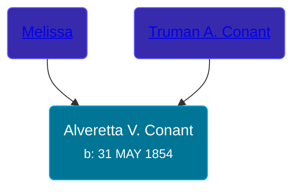

## 🟣 Alveretta V. Conant
<small>Age: 66y, 7m, 2d</small>

Daughter of [Truman A. Conant](/people/6/67469728) and [Melissa ](/people/7/76673536)





### 📆 Events


Type | Date | Age at Event | Place
------ | ------ | ------ | ------
Birth | 31 MAY 1854 |  | Wisconsin, USA
[Residence](#event-event-0) | 05 SEP 1860 | 6y, 3m, 4d | Kickapoo, Bad Ax, Wisconsin, USA
[Residence](#event-event-1) | 1870 | 15y, 6m, -1d | Lafayette, Monroe, Wisconsin, USA
[Residence](#event-event-2) | Jun 1880 | 26y, -1d | Robinson Township, Ottawa, Michigan, USA
[Residence](#event-event-3) | 05 JUN 1900 | 46y, 4d | Robinson Township, Ottawa, Michigan, USA
[Residence](#event-event-4) | 16 JAN 1920 | 65y, 7m, 15d | Grand Haven, Ottawa, Michigan, USA
Death | 03 JAN 1921 | 66y, 7m, 2d | Michigan, USA
[Burial](#event-event-10) |  |  | Robinson Township Cemetery, Robinson Township, Ottawa, Michigan, USA



- **Birth**
**Date**: 31 MAY 1854, Age:
**Place**: Wisconsin, USA
- **[Residence](#event-event-0)**
**Date**: 05 SEP 1860, Age: 6y, 3m, 4d
**Place**: Kickapoo, Bad Ax, Wisconsin, USA
- **[Residence](#event-event-1)**
**Date**: 1870, Age: 15y, 6m, -1d
**Place**: Lafayette, Monroe, Wisconsin, USA
- **[Residence](#event-event-2)**
**Date**: Jun 1880, Age: 26y, -1d
**Place**: Robinson Township, Ottawa, Michigan, USA
- **[Residence](#event-event-3)**
**Date**: 05 JUN 1900, Age: 46y, 4d
**Place**: Robinson Township, Ottawa, Michigan, USA
- **[Residence](#event-event-4)**
**Date**: 16 JAN 1920, Age: 65y, 7m, 15d
**Place**: Grand Haven, Ottawa, Michigan, USA
- **Death**
**Date**: 03 JAN 1921, Age: 66y, 7m, 2d
**Place**: Michigan, USA
- **[Burial](#event-event-10)**
**Date**:
**Place**: Robinson Township Cemetery, Robinson Township, Ottawa, Michigan, USA


## 👩‍❤️‍👨 Relationships

### 🔵 [Reuben Hess Conant](/people/3/37326838), b. 25 OCT 1839

#### Events


Type | Date | Age at Event | Place
------ | ------ | ------ | ------
Marriage | 1874 | 19y, 6m, -1d |



- **Marriage**
**Date**: 1874, Age: 19y, 6m, -1d
**Place**:


#### Children With Reuben Hess Conant
* 🔵 [Nelson H. Conant](/people/9/90473988), b. 17 AUG 1874
* 🟣 [Cora Mabel Conant](/people/7/75623980), b. 22 NOV 1876
* 🔵 [George Truman Conant](/people/5/50624075), b. about 1878
* 🔵 [Ernest Conant](/people/4/4994264), b. Jan 1881
* 🟣 [Lulu Conant](/people/6/66371832), b. May 1886
* 🟣 [Wanda Conant](/people/3/3340870), b. Nov 1891
### 📰 Event Sources

####  Residence, 05 SEP 1860
* 1860 US Census

####  Residence, 1870
* 1870 US Census

####  Residence, Jun 1880
* 1880 US Census

####  Residence, 05 JUN 1900
* 1900 US Census

####  Residence, 16 JAN 1920
* 1920 US Census

####  Burial
* findagrave.com

####  Marriage, 1874
