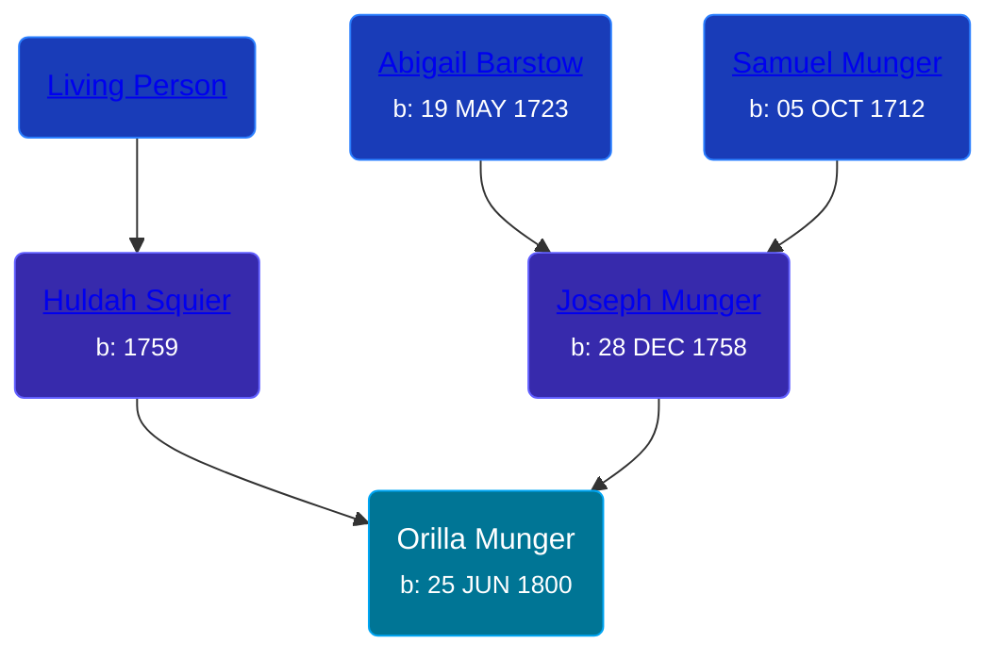

## 🟣 Orilla Munger

Daughter of [Joseph Munger](/people/4/48832802) and [Huldah Squier](/people/4/40449307)





### 📆 Events


Type | Date | Age at Event | Place
------ | ------ | ------ | ------
[Birth](#event-event-2) | 25 JUN 1800 |  | Monson, Massachusetts, USA



- **[Birth](#event-event-2)**
**Date**: 25 JUN 1800, Age:
**Place**: Monson, Massachusetts, USA


### 📰 Event Sources

####  Birth, 25 JUN 1800
* Massachusetts, Town and Vital Records, 1620-1988  - 274