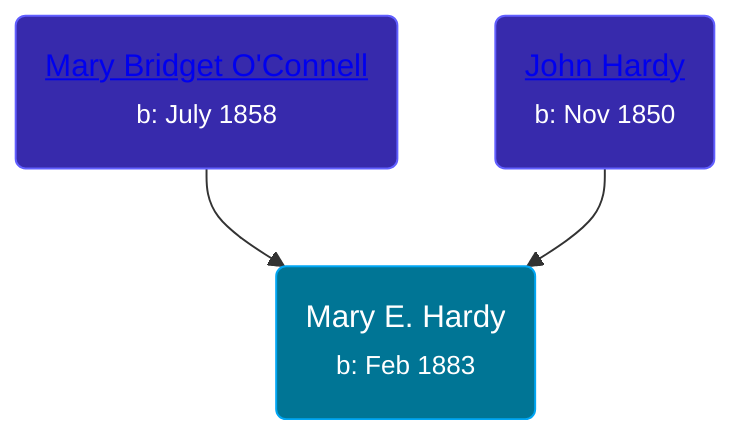

## 🟣 Mary E. Hardy

Daughter of [John Hardy](/people/5/56182816) and [Mary Bridget O'Connell](/people/4/47047024)





### 📆 Events


Type | Date | Age at Event | Place
------ | ------ | ------ | ------
Birth | Feb 1883 |  | Kansas, USA
[Residence](#event-event-0) | 01 MAR 1885 | 2y, 1m, 1d | Rock Creek, Coffey, Kansas, USA
[Residence](#event-event-1) | 04 JUN 1900 | 17y, 4m, 4d | Omaha, Douglas, Nebraska, USA



- **Birth**
**Date**: Feb 1883, Age:
**Place**: Kansas, USA
- **[Residence](#event-event-0)**
**Date**: 01 MAR 1885, Age: 2y, 1m, 1d
**Place**: Rock Creek, Coffey, Kansas, USA
- **[Residence](#event-event-1)**
**Date**: 04 JUN 1900, Age: 17y, 4m, 4d
**Place**: Omaha, Douglas, Nebraska, USA


### 📰 Event Sources

####  Residence, 01 MAR 1885
* Kansas State Census Collection, 1855-1925

####  Residence, 04 JUN 1900
* 1900 US Census
