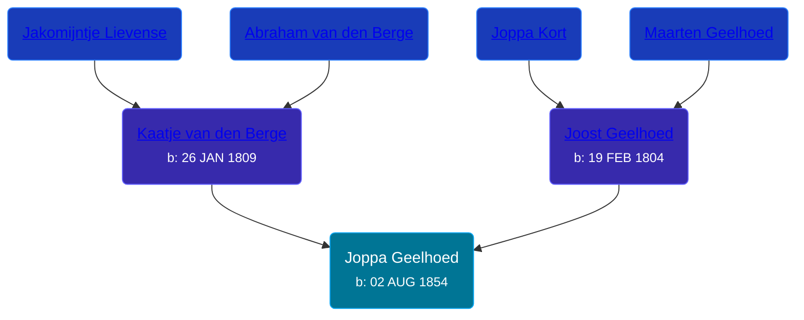

## 🟣 Joppa Geelhoed
<small>Age: 32y, 11m, 9d</small>

Daughter of [Joost Geelhoed](/people/7/72031888) and [Kaatje van den Berge](/people/3/32271874)





### 📆 Events


Type | Date | Age at Event | Place
------ | ------ | ------ | ------
[Birth](#event-event-2) | 02 AUG 1854 |  | Dreischor, Zeeland, Netherlands
[Death](#event-event-3) | 11 JUL 1887 | 32y, 11m, 9d | Oudelande, Netherlands



- **[Birth](#event-event-2)**
**Date**: 02 AUG 1854, Age:
**Place**: Dreischor, Zeeland, Netherlands
- **[Death](#event-event-3)**
**Date**: 11 JUL 1887, Age: 32y, 11m, 9d
**Place**: Oudelande, Netherlands


### 📰 Event Sources

####  Birth, 02 AUG 1854
* Geelhoet, Geelhoed & Geelhoedt Genealogie

####  Death, 11 JUL 1887
* Geelhoet, Geelhoed & Geelhoedt Genealogie