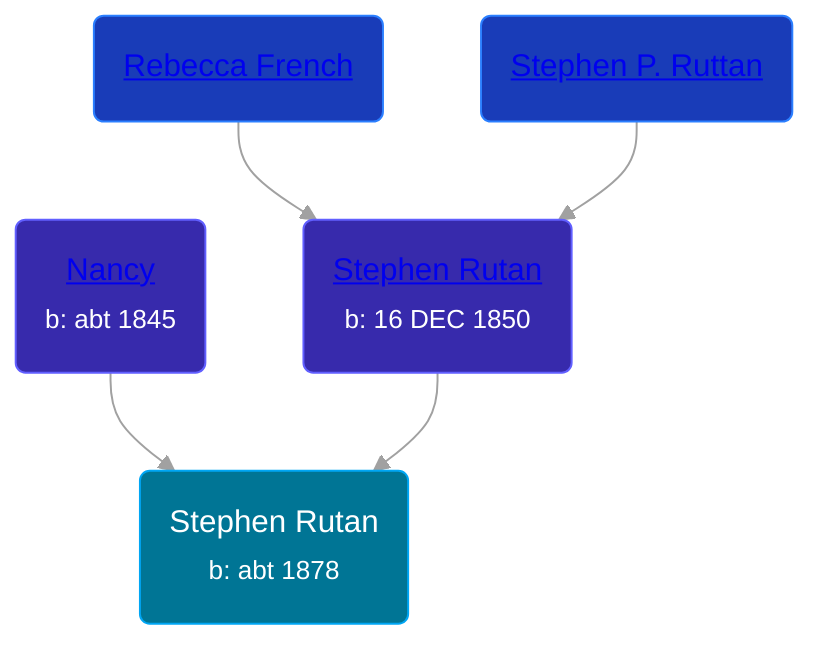

## 🔵 Stephen Rutan

Son of [Stephen Rutan](/people/3/38101242) and [Nancy ](/people/2/21074596)





### 📆 Events


Type | Date | Age at Event | Place
------ | ------ | ------ | ------
Birth | abt 1878 |  | Michigan, USA
[Residence](#event-event-1) | 04 JUN 1880 | 2y, 6m, 4d | Somerset Township, Hillsdale, Michigan, USA



- **Birth**
**Date**: abt 1878, Age:
**Place**: Michigan, USA
- **[Residence](#event-event-1)**
**Date**: 04 JUN 1880, Age: 2y, 6m, 4d
**Place**: Somerset Township, Hillsdale, Michigan, USA


### 📰 Event Sources

####  Residence, 04 JUN 1880
* 1880 US Census
