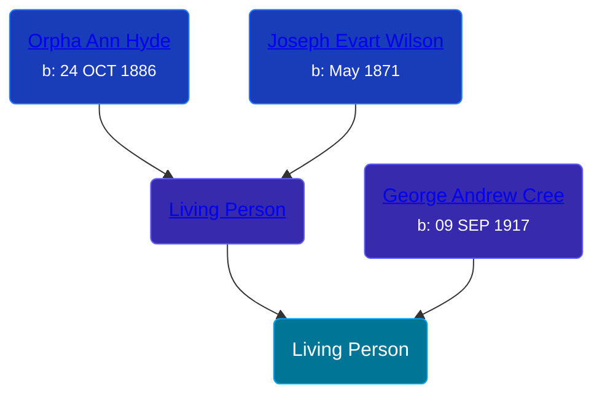

## 🔵 Living Person

Son of [George Andrew Cree](/people/1/19357156) and [Living Person](/people/7/74548303)



```mermaid
graph
classDef grands fill:#193cb8,stroke:#2b7fff,stroke-width:1px,color:#fff;
classDef parents fill:#372aac,stroke:#615fff,stroke-width:1px,color:#fff;
classDef primary fill:#007595,stroke:#00a6f4,stroke-width:1px,color:#fff;
60999639(Living Person):::primary
74548303(<a class="text-white" href="/people/7/74548303">Living Person</a>):::parents-->60999639
63932813(<a class="text-white" href="/people/6/63932813">Orpha Ann Hyde</a><br /><small>b: 24 OCT 1886</small>):::grands-->74548303
57306025(<a class="text-white" href="/people/5/57306025">Joseph Evart Wilson</a><br /><small>b: May 1871</small>):::grands-->74548303
19357156(<a class="text-white" href="/people/1/19357156">George Andrew Cree</a><br /><small>b: 09 SEP 1917</small>):::parents-->60999639
```


## 👩â€â¤ï¸â€ğŸ‘¨ Relationships

### 🟣 [Living Person](/people/4/45559688)
