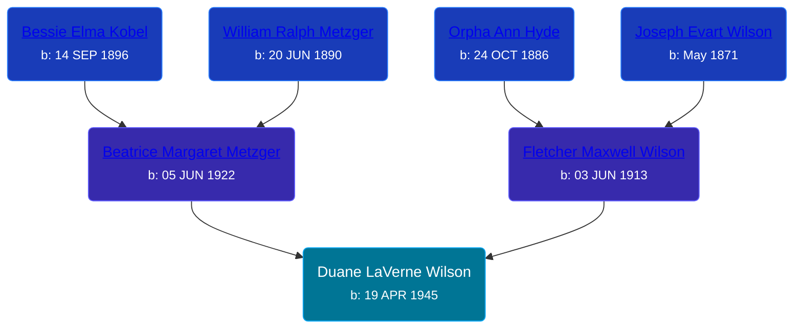

## 🔵 Duane LaVerne Wilson
<small>Age: 60y, 3m, 1d</small>

Son of [Fletcher Maxwell Wilson](/people/3/32597724) and [Beatrice Margaret Metzger](/people/7/79763948)





### 📆 Events


Type | Date | Age at Event | Place
------ | ------ | ------ | ------
Birth | 19 APR 1945 |  | Grand Rapids, Kent, Michigan, United States
[Residence](#event-event-0) | 07 APR 1950 | 4y, 11m, 18d | Wyoming, Kent, Michigan, USA
[Death](#event-event-5) | 20 JUL 2005 | 60y, 3m, 1d | Grand Rapids, Kent, Michigan, United States
[Burial](#event-event-6) |  |  | Chapel Hill Memorial Gardens, Cascade, Kent, Michigan, USA



- **Birth**
**Date**: 19 APR 1945, Age:
**Place**: Grand Rapids, Kent, Michigan, United States
- **[Residence](#event-event-0)**
**Date**: 07 APR 1950, Age: 4y, 11m, 18d
**Place**: Wyoming, Kent, Michigan, USA
- **[Death](#event-event-5)**
**Date**: 20 JUL 2005, Age: 60y, 3m, 1d
**Place**: Grand Rapids, Kent, Michigan, United States
- **[Burial](#event-event-6)**
**Date**:
**Place**: Chapel Hill Memorial Gardens, Cascade, Kent, Michigan, USA


## 👩‍❤️‍👨 Relationships

### 🟣 [Martha Arlene Postma](/people/3/39368292), b. 18 FEB 1944

#### Events


Type | Date | Age at Event | Place
------ | ------ | ------ | ------
[Marriage](#event-family-0-event-0) | 27 MAR 1964 | 18y, 11m, 8d | Grand Rapids, Kent, Michigan, United States



- **[Marriage](#event-family-0-event-0)**
**Date**: 27 MAR 1964, Age: 18y, 11m, 8d
**Place**: Grand Rapids, Kent, Michigan, United States


#### Children With Martha Arlene Postma
* 🟣 [Living Person](/people/9/92555368)
* 🔵 [Duane LaVerne Wilson](/people/2/26268040), b. 08 SEP 1965
* 🟣 [Living Person](/people/4/47560746)
* 🟣 [Living Person](/people/4/46067436)
* 🔵 [Keith Allen Wilson](/people/3/37910144), b. 02 JUN 1970
## 📝 Notes
>   
  > Duane changed his last name from Peterson to Wilson, after his step father, when he married Martha.
>   
  > I believe that Duane is the biological son of Fletcher Wilson based on DNA matches between Duane's grandchildren and other descendants of Joseph, Fletcher's father.
### 📰 Event Sources

####  Residence, 07 APR 1950
* 1950 US Census
>   
  > Name: Duane L Peterson  
  > Age: 4  
  > Birth Date: abt 1946  
  > Gender: Male  
  > Race: White  
  > Birth Place: Michigan  
  > Marital Status: Never Married (Single)  
  > Relation to Head of House: Stepson (Step Son)  
  > Residence Date: 1950  
  > Home in 1950: Wyoming, Kent, Michigan, USA  
  > Street Name: Longstreet Ave  
  > House Number: 2705  
  > Dwelling Number: 96  
  > Farm: No  
  >   
  > Household members:  
  > Fletcher M Wilson, 36, Head  
  > Beatrice M Wilson, 27, Wife  
  > William D Wilson, 12, Son  
  > Marvin J Wilson, 10, Son  
  > Judith A Wilson, 9, Daughter  
  > Duane L Peterson, 4, Stepson  
  >

####  Death, 20 JUL 2005
* MLive
>   
  > DUANE WILSON OBITUARY  
  >   
  > WILSON - Mr. Duane LaVerne Wilson Sr., age 60, passed away suddenly Wednesday, July 20, 2005. Duane was preceded in death by his son, Duane LaVerne Wilson Jr., father, Fletcher and his brother, Marvin. He will be deeply missed by his wife of 41 years, Martha as well as his children, Kelly (Larry) Barton, Kim (Chad) Zylstra, Karrie (Jeff) Miller and Keith Wilson; grandchildren, Larry Jr., Kristopher, Rick, Nicole, Jonathan, Mike, Matt, Casey, Tasha, Andrea and Ryan; mother, Beatrice Wilson; brother and sisters, Bill (Judy) Wilson, Judy Jeske and Bea (Dennis) Hartley; brothers-in-law and sisters-in-law and his aunt, uncle, nieces and nephews. Funeral services will be held Monday at 1 p.m. at the Cook Memorial Chapel (east building), 4235 Prairie SW. Interment services will be at Chapel Hill Memorial Gardens. Relatives and friends may meet Duane's family on Sunday from 3 to 5 p.m. at the Cook Funeral Home (west building). Those unable to attend the visitation or funeral service may sign the family's Memory Book at www.cookfuneralhome.com.
* U.S., Social Security Death Index, 1935-2014
>   
  > Name: Duane L. Wilson  
  > Social Security Number: XXX-XX-XXXX  
  > Birth Date: 19 Apr 1945  
  > Issue year: 1961-1962  
  > Issue State: Michigan  
  > Death Date: 20 Jul 2005

####  Burial
* Chapel Hill Memorial Gardens
>   
  > Wilson, Duane L.  
  > b: 1945; d: 2005

####  Marriage, 27 MAR 1964
* Kent County Marriage Records