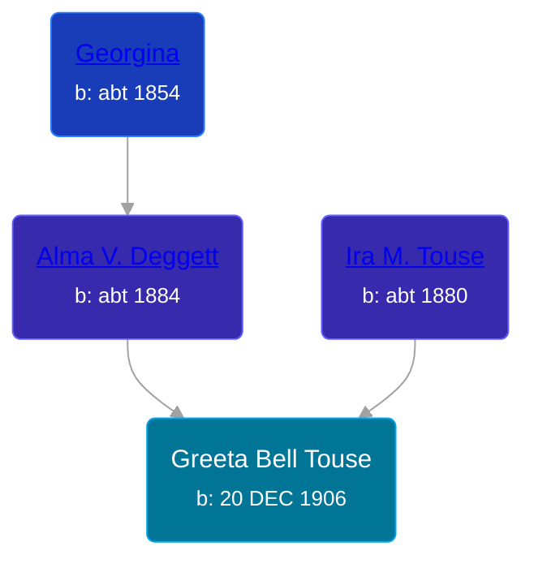

## 🟣 Greeta Bell Touse
<small>Age: 87y, 1m, 15d</small>

Daughter of [Ira M. Touse](/people/4/43588740) and [Alma V. Deggett](/people/4/42271632)





### 📆 Events


Type | Date | Age at Event | Place
------ | ------ | ------ | ------
[Birth](#event-event-3) | 20 DEC 1906 |  | Jackson, Jackson, Michigan, USA
[Residence](#event-event-0) | 07 MAY 1910 | 3y, 4m, 17d |
[Residence](#event-event-1) | 21 JAN 1920 | 13y, 1m, 1d | Somerset Township, Hillsdale, Michigan, USA
[Residence](#event-event-2) | 08 APR 1930 | 23y, 3m, 18d | Napolean, Jackson, Michigan, USA
[Residence](#event-event-3) | 10 APR 1940 | 33y, 3m, 20d | Napolean, Jackson, Michigan, USA
[Residence](#event-event-4) | 04 MAY 1950 | 43y, 4m, 14d | Columbia, Jackson, Michigan, USA
[Death](#event-event-9) | 05 FEB 1994 | 87y, 1m, 15d | Jackson, Jackson, Michigan, USA



- **[Birth](#event-event-3)**
**Date**: 20 DEC 1906, Age:
**Place**: Jackson, Jackson, Michigan, USA
- **[Residence](#event-event-0)**
**Date**: 07 MAY 1910, Age: 3y, 4m, 17d
**Place**:
- **[Residence](#event-event-1)**
**Date**: 21 JAN 1920, Age: 13y, 1m, 1d
**Place**: Somerset Township, Hillsdale, Michigan, USA
- **[Residence](#event-event-2)**
**Date**: 08 APR 1930, Age: 23y, 3m, 18d
**Place**: Napolean, Jackson, Michigan, USA
- **[Residence](#event-event-3)**
**Date**: 10 APR 1940, Age: 33y, 3m, 20d
**Place**: Napolean, Jackson, Michigan, USA
- **[Residence](#event-event-4)**
**Date**: 04 MAY 1950, Age: 43y, 4m, 14d
**Place**: Columbia, Jackson, Michigan, USA
- **[Death](#event-event-9)**
**Date**: 05 FEB 1994, Age: 87y, 1m, 15d
**Place**: Jackson, Jackson, Michigan, USA


## 👩‍❤️‍👨 Relationships

### 🔵 [Milton Wheeler Rutan](/people/2/20825556), b. 07 NOV 1901

#### Events


Type | Date | Age at Event | Place
------ | ------ | ------ | ------
[Marriage](#event-family-0-event-0) | 07 NOV 1926 | 19y, 10m, 17d | Napolean, Jackson, Michigan, USA



- **[Marriage](#event-family-0-event-0)**
**Date**: 07 NOV 1926, Age: 19y, 10m, 17d
**Place**: Napolean, Jackson, Michigan, USA


#### Children With Milton Wheeler Rutan
* 🔵 [Living Person](/people/5/56143808)
* 🔵 [Living Person](/people/5/53455468)
* 🔵 [LeEarl Stephen Rutan](/people/7/75225835), b. 03 JUN 1932
* 🟣 [Living Person](/people/5/51896715)
* 🟣 [Living Person](/people/7/73053745)
* 🟣 [Living Person](/people/2/29215456)
* 🔵 [Living Person](/people/1/19671878)
* 🔵 [Living Person](/people/7/75570413)
* 🟣 [Living Person](/people/9/94142488)
### 📰 Event Sources

####  Birth, 20 DEC 1906
* Michigan, U.S., Birth Records, 1867-1914
>
  > Name: Greeta Bell Touse
  > Gender: Female
  > Birth Date: 20 Dec 1906
  > Birth Place: Jackson, Michigan, USA
  > Father: Ira N. Touse
  > Mother: Alma Daggett
  > Jurisdiction Number: 601-850
  > Reference Number: Vol 25D

####  Residence, 07 MAY 1910
* 1910 US Census
>
  > Name: Gretta B Touse
  > Age in 1910: 3
  > Birth Date: 1907
  > Birthplace: Michigan
  > Home in 1910: Somerset, Hillsdale, Michigan, USA
  > Sheet Number: 11a
  > Race: White
  > Gender: Female
  > Relation to Head of House: Daughter
  > Marital Status: Single
  > Father's Birthplace: Michigan
  > Mother's Birthplace: Michigan
  > Enumeration District Number: 0117
  > Enumerated Year: 1910
  >
  > Household members:
  > Ira Touse, 30
  > Alma V Touse, 26
  > Wills I Touse, 5
  > Gretta B Touse, 3

####  Residence, 21 JAN 1920
* 1920 US Census
>
  > Name: Greta B Fouse
  > Age: 13
  > Birth Year: 1907
  > Birthplace: Michigan
  > Home in 1920: Somerset, Hillsdale, Michigan
  > Residence Date: 1920
  > Race: White
  > Gender: Female
  > Relation to Head of House: Daughter
  > Marital Status: Single
  > Father's Name: Ira M Fouse
  > Father's Birthplace: Michigan
  > Mother's Name: Elma V Fouse
  > Mother's Birthplace: Michigan
  > Able to Speak English: Yes
  > Attended School: Yes
  > Able to Read: Yes
  > Able to Write: Yes
  >
  > Household members:
  > Ira M Fouse, 40
  > Elma V Fouse, 36
  > Willo I Fouse, 14
  > Greta B Fouse, 13
  > Georgina Daggett, 66

####  Marriage, 07 NOV 1926
* Michigan, Marriage Records, 1867-1952
>
  > Name: Mr Milton W Rutan
  > Gender: Male
  > Race: White
  > Age: 25
  > Birth Date: 1901
  > Birth Place: Michigan
  > Marriage License Place: Jackson
  > Marriage Date: 7 Nov 1926
  > Marriage Place: Napoleon, Jackson, Michigan, USA
  > Residence Place: Mancelona, Michigan
  > Father: Earl Rutan
  > Mother: Fletemce Wheeler
  > Spouse: Greeta B Touse
  > Spouse Gender: Female
  > Spouse Race: White
  > Spouse Age: 18
  > Spouse Birth Date: abt 1908
  > Spouse Birth Place: Michigan
  > Spouse Residence Place: Napoleon, Michigan
  > Spouse Father: Ira M Touse
  > Spouse Mother: Alma Deggett
  > State File Number: 38 730

####  Residence, 08 APR 1930
* 1930 US Census
>
  > Name: Greeta B Rutan
  > Birth Year: abt 1907
  > Gender: Female
  > Race: White
  > Age in 1930: 23
  > Birthplace: Michigan
  > Marital Status: Married
  > Relation to Head of House: Wife
  > Homemaker: Yes
  > Home in 1930: Napoleon, Jackson, Michigan, USA
  > Street Address: North Stoney Lake Road
  > Dwelling Number: 75
  > Family Number: 76
  > Age at First Marriage: 20
  > Attended School: No
  > Able to Read and Write: Yes
  > Father's Birthplace: Michigan
  > Mother's Birthplace: Michigan
  > Able to Speak English: Yes
  >
  > Household members:
  > Milton Rutan, 28, Head
  > Greeta B Rutan, 23, Wife
  > Paul R Rutan, 2, Son
  > Louis W Rutan, 0, Son
  > Cecil D Rutan, 19, Sister
  >

####  Residence, 10 APR 1940
* 1940 US Census
>
  > Name: Greta D Rutan
  > Age: 33
  > Estimated Birth Year: abt 1907
  > Gender: Female
  > Race: White
  > Birthplace: Michigan
  > Marital Status: Married
  > Relation to Head of House: Daughter
  > Home in 1940: Napoleon, Jackson, Michigan
  > Street: Cranbering Lake Road
  > Inferred Residence in 1935: Rural
  > Residence in 1935: Rural
  > Resident on Farm in 1935: Yes
  > Sheet Number: 6A
  > Attended School or College: No
  > Highest Grade Completed: High School, 2nd year
  > Weeks Worked in 1939: 0
  > Income: 0
  > Income Other Sources: No
  >
  > Household Members
  > Ira M Touse, 60, Head
  > Alma V Touse, 56, Wife
  > Milton W Rutan, 38, Son-in-law
  > Grata D Rutan, 33, Daughter
  > Paul R Rutan, 12, Grandson
  > Louis W Rutan, 11, Grandson
  > L Earl S Rutan, 7, Grandson
  > Florence J Rutan, 5, Granddaughter
  > Gayl A Rutan, 3, Granddaughter
  > Mary L Rutan, 1, Granddaughter

####  Residence, 04 MAY 1950
* 1950 US Census
>
  > Name: Greeta B Rutan
  > Age: 42
  > Birth Date: abt 1908
  > Gender: Female
  > Race: White
  > Birth Place: Michigan
  > Marital Status: Married
  > Relation to Head of House: Wife
  > Residence Date: 1950
  > Home in 1950: Columbia, Jackson, Michigan, USA
  > Street Name: Reed Rd
  > House Number: 4497
  > Dwelling Number: 475
  > Farm: Yes
  > Occupation Category: H
  > Worked Last Week: No
  > Seeking Work: No
  > Employment Status: No
  >
  > Household members:
  > Milton W. Rutan, 48, Head
  > Greeta B. Rutan, 42, Wife
  > Paul R. Rutan, 22, Son
  > LeEarl S. Rutan, 17, Son
  > Florence J. Rutan, 15, Daughter
  > Gayle A. Rutan, 13, Daughter
  > Mary L. Rutan, 11, Daughter
  > Milton Rutan Jr, 6, Son
  > Bruce W. Rutan, 2, Son
  > Alice May Rutan, Feb 1950, Daughter
  >
####  Death, 05 FEB 1994
* U.S., Social Security Death Index, 1935-2014
>
  > Name: Greeta B. Rutan
  > Social Security Number: 363-48-6813
  > Birth Date: 20 Dec 1906
  > Issue Year: 1963
  > Issue State: Michigan
  > Last Residence: 49234, Clarklake, Jackson, Michigan, USA
  > Death Date: 5 Feb 1994
* Michigan Deaths, 1971-1996
>
  > Name: Greeta B. Rutan
  > Birth Date: 20 Dec 1906
  > Death Date: 5 Feb 1994
  > Gender: Female
  > Residence: Columbia, Jackson, Michigan
  > Place of Death: Jackson, Jackson, Michigan

