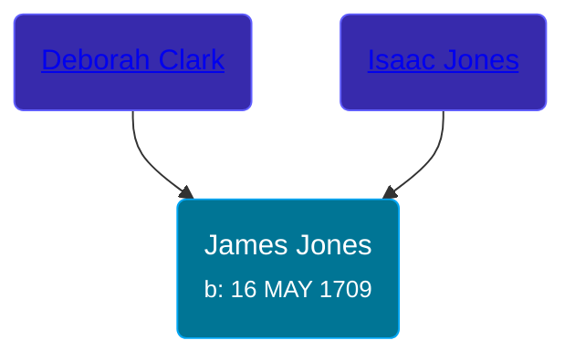

## 🔵 James Jones
<small>Age: 58y, 9m, 14d</small>

Son of [Isaac Jones](/people/7/74416956) and [Deborah Clark](/people/1/1648568)





### 📆 Events


Type | Date | Age at Event | Place
------ | ------ | ------ | ------
[Birth](#event-event-2) | 16 MAY 1709 |  | New Haven, New Haven, Connecticut, USA
[Death](#event-event-3) | Mar 1768 | 58y, 9m, 14d | Saybrook, Middlesex, Connecticut, USA



- **[Birth](#event-event-2)**
**Date**: 16 MAY 1709, Age:
**Place**: New Haven, New Haven, Connecticut, USA
- **[Death](#event-event-3)**
**Date**: Mar 1768, Age: 58y, 9m, 14d
**Place**: Saybrook, Middlesex, Connecticut, USA


## 👩‍❤️‍👨 Relationships

### 🟣 [Sarah Willard](/people/2/24374592), b. 18 MAY 1717

#### Events


Type | Date | Age at Event | Place
------ | ------ | ------ | ------
[Marriage](#event-family-0-event-0) | 31 MAY 1737 | 28y, 15d | Saybrook, Middlesex, Connecticut, USA



- **[Marriage](#event-family-0-event-0)**
**Date**: 31 MAY 1737, Age: 28y, 15d
**Place**: Saybrook, Middlesex, Connecticut, USA


#### Children With Sarah Willard
* 🟣 [Living Person](/people/1/1434019)
* 🔵 [Living Person](/people/6/69352096)
* 🔵 [Living Person](/people/4/45197660)
* 🔵 [Living Person](/people/1/10134440)
* 🟣 [Sarah Jones](/people/9/95119732), b. 22 MAY 1741
* 🟣 [Hannah Jones](/people/3/3592220), b. 15 NOV 1741
* 🔵 [James Jones](/people/3/31141841), b. abt 19 JAN 1743
* 🔵 [Timothy Jones](/people/6/63580840), b. 05 JUN 1755
* 🔵 [George Jones](/people/1/12539052), b. 14 FEB 1759
### 📰 Event Sources

####  Birth, 16 MAY 1709
* The New England Historical and Genealogical Register  - 313

####  Marriage, 31 MAY 1737
* The New England Historical and Genealogical Register  - 313
####  Death, Mar 1768
* The New England Historical and Genealogical Register  - 313
