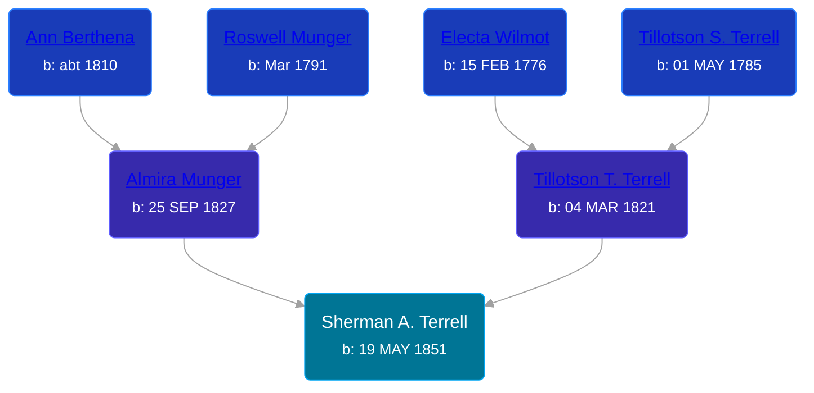

## 🔵 Sherman A. Terrell
<small>Age: 77y, 1m, 17d</small>

Son of [Tillotson T. Terrell](/people/5/59687792) and [Almira Munger](/people/3/36419408)





### 📆 Events


Type | Date | Age at Event | Place
------ | ------ | ------ | ------
Birth | 19 MAY 1851 |  | Lorain, Ohio, USA
[Residence](#event-event-0) | 28 JUN 1860 | 9y, 1m, 9d | Byron Township, Kent, Michigan, USA
[Residence](#event-event-1) | 16 AUG 1870 | 19y, 2m, 27d | Paris Township, Kent, Michigan, USA
[Residence](#event-event-2) | 1880 | 28y, 6m, 11d | Byron Township, Kent, Michigan, USA
[Death](#event-event-6) | 06 JUL 1928 | 77y, 1m, 17d | Byron Center, Kent, Michigan, USA
[Burial](#event-event-7) | 08 JUL 1928 | 77y, 1m, 19d | Winchester Cemetery, Byron Township, Kent, Michigan, USA



- **Birth**
**Date**: 19 MAY 1851, Age:
**Place**: Lorain, Ohio, USA
- **[Residence](#event-event-0)**
**Date**: 28 JUN 1860, Age: 9y, 1m, 9d
**Place**: Byron Township, Kent, Michigan, USA
- **[Residence](#event-event-1)**
**Date**: 16 AUG 1870, Age: 19y, 2m, 27d
**Place**: Paris Township, Kent, Michigan, USA
- **[Residence](#event-event-2)**
**Date**: 1880, Age: 28y, 6m, 11d
**Place**: Byron Township, Kent, Michigan, USA
- **[Death](#event-event-6)**
**Date**: 06 JUL 1928, Age: 77y, 1m, 17d
**Place**: Byron Center, Kent, Michigan, USA
- **[Burial](#event-event-7)**
**Date**: 08 JUL 1928, Age: 77y, 1m, 19d
**Place**: Winchester Cemetery, Byron Township, Kent, Michigan, USA


### 📰 Event Sources

####  Residence, 28 JUN 1860
* 1860 US Census

####  Residence, 16 AUG 1870
* 1870 US Census

####  Residence, 1880
* 1880 US Census

####  Death, 06 JUL 1928
* The Grand Rapids Press  - 6 Jul 1928
>   
  > TERRELL -- Sherman A. Terrell, aged 77, died Friday morning at his home in Byron Center. Mr. Terrell had been a resident of Byron Center 55 years. He is survived by his widow; one son, Glen J. Terrell of Grand Rapids; two grandsons, James and Robert, and one brother, Kirtland Terrell of Grand Rapids. Funeral services will be held at 2:30 Sunday afternoon at the M. E. church, Byron Center. Interment in Winchester cemetery.
* Byron Township Death Records, 1903 - 1956
>   
  > Name: Terrell, Sherman A.  
  > Spouse: Ellen  
  > Born: 19 May 1851  
  > Died: 06 Jul 1928  
  > Age: 77  
  > Burial At: Winchester Cemetery  
  > Born: Ohio  
  > Father: Tillotson  
  > Born: Ohio  
  > Mother: Almira Monger  
  > Born: Ohio

####  Burial, 08 JUL 1928
* Winchester Cemetery
>   
  > Terrell, Sherman  
  > b: 1851; d: 1928
