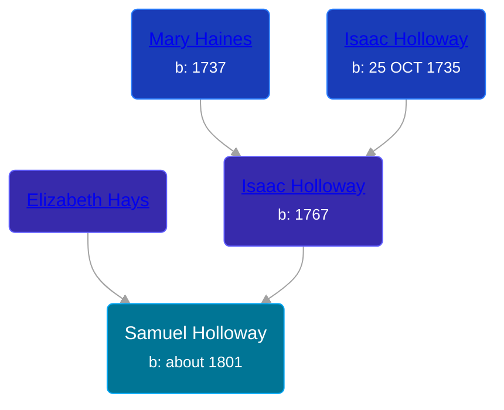

## 🔵 Samuel Holloway

Son of [Isaac Holloway](/people/9/9759504) and [Elizabeth Hays](/people/8/83876909)





### 📆 Events


Type | Date | Age at Event | Place
------ | ------ | ------ | ------
Birth | about 1801 |  | North Carolina, USA
[Residence](#event-event-0) | 24 SEP 1850 | 49y, 9m, 24d | Whitley, Indiana, USA
[Residence](#event-event-1) | 17 JUL 1860 | 59y, 7m, 17d | Richland Township, Whitley, Indiana, USA



- **Birth**
**Date**: about 1801, Age:
**Place**: North Carolina, USA
- **[Residence](#event-event-0)**
**Date**: 24 SEP 1850, Age: 49y, 9m, 24d
**Place**: Whitley, Indiana, USA
- **[Residence](#event-event-1)**
**Date**: 17 JUL 1860, Age: 59y, 7m, 17d
**Place**: Richland Township, Whitley, Indiana, USA


## 👩‍❤️‍👨 Relationships

### 🟣 [Rosanna Casner](/people/1/11187132), b. about 1818

#### Events


Type | Date | Age at Event | Place
------ | ------ | ------ | ------
[Marriage](#event-family-0-event-0) | 08 MAY 1838 | 37y, 5m, 8d |



- **[Marriage](#event-family-0-event-0)**
**Date**: 08 MAY 1838, Age: 37y, 5m, 8d
**Place**:


#### Children With Rosanna Casner
* 🔵 [William Riley Holloway](/people/9/90949012), b. 13 MAY 1845
### 📰 Event Sources

####  Marriage, 08 MAY 1838
* Ohio, County Marriages, 1774-1993
>   
  > Name: Samuel Hollaway  
  > Gender: Male  
  > Marriage Date: 8 May 1838  
  > Marriage Place: Coshocton, Ohio, USA  
  > Spouse: Rosanna Hashner  
  > Film Number: 000895287

####  Residence, 24 SEP 1850
* 1850 US Census
>   
  > Name: Samuel Holloway  
  > Gender: Male  
  > Race: White  
  > Age: 49  
  > Birth Year: 1801  
  > Birthplace: North Carolina  
  > Home in 1850: Whitley, Indiana, USA  
  > Occupation: Farmer  
  > Industry: Agriculture  
  > Real Estate: 700  
  > Cannot Read, Write: Yes  
  > Line Number: 23  
  > Dwelling Number: 561  
  > Family Number: 579  
  > Inferred Spouse: Rosannah Holloway  
  > Inferred Child: Phebe Holloway; George W Holloway; William R Holloway; Sarah J Holloway

####  Residence, 17 JUL 1860
* 1860 US Census
>   
  > Name: Samuel Holloway  
  > Age: 60  
  > Birth Year: 1800  
  > Gender: Male  
  > Race: White  
  > Birth Place: North Carolina  
  > Home in 1860: Richland, Whitley, Indiana  
  > Dwelling Number: 1214  
  > Family Number: 1219  
  > Occupation: Farmer  
  > Real Estate Value: 2000  
  > Personal Estate Value: 300  
  > Cannot Read, Write: Y  
  > Inferred Spouse: Susannah Holloway